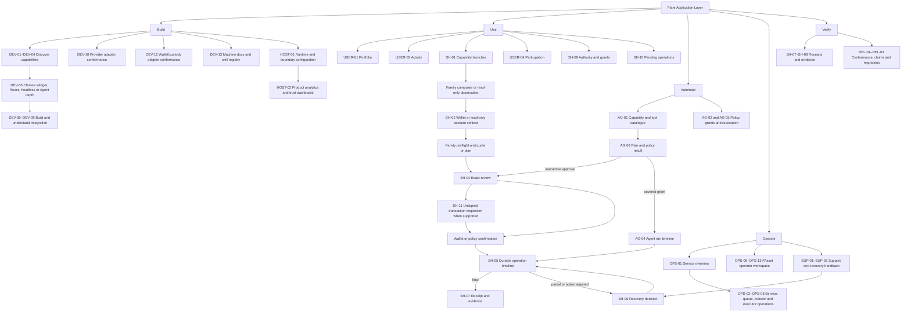

# Product Surface Map: Flare Application Layer

Date: 2026-08-03  
Status: accepted comprehensive product-surface contract; revised after participant navigation feedback and explicitly accepted on 2026-08-03.  
Canonical decision: [Full Flare Application Layer scope](../decisions/2026-08-03-full-flare-application-layer-scope.md).  
Accepted specification: [Flare Application Layer](../specs/2026-08-03-flare-application-layer.md).  
Accepted stories: [Flare Application Layer stories](../stories/2026-08-03-flare-application-layer.md).  
Story-gate evidence: [Verification audit](../verification/2026-08-03-flare-application-layer-story-audit.md).

> **Extended 2026-08-03 from 112 to 117 surfaces.** A Bounty 1 coverage audit
> found two named product directions uncovered: merchant-side payment flows
> (every payment surface here is written from the payer's side) and liquidity
> provision to venue pools (every LIQ surface here is a vault). Added as PAY-03,
> PAY-04, LIQ-04, LIQ-05 and LIQ-06 in
> [merchant and liquidity surfaces](../specs/2026-08-03-merchant-and-liquidity-surfaces.md).
> No surface below is removed or renumbered.

## Purpose And Boundary

This map defines every logical screen, embed, panel, sheet, drawer and generated product artifact a
designer or builder would otherwise have to invent. A “surface” may render as a full page, embedded
widget, side panel or modal depending on the host and responsive context; that presentation choice
does not remove its required content or states.

This artifact decides product anatomy, not visual style or code architecture. It does not select a
final name, route structure, package namespace, provider, managed-service model, FCC application
domain, component library, responsive breakpoint, database or API. It stops before wireframes,
visual direction, component design and implementation.

## Surface Principles

1. **One lifecycle, many presentations.** Headless, React, widget, agent, operator and support
   surfaces display the same operation, step, approval, recovery and receipt semantics.
2. **Direct embeds remain complete.** A host may deep-link directly into one action; the user does not
   have to enter a project-owned dashboard first.
3. **Long waits are destinations.** Proof, executor, bridge, epoch, staking and FCC waits have durable
   timeline surfaces that survive reload and explain the awaited actor and safe next action.
4. **Partial outcomes are first-class.** Source success with destination, provider, executor or
   settlement failure never collapses into a generic success/error toast.
5. **Provider and authority truth stays visible.** Normalization may simplify layout but cannot hide
   provider, route, custody, delegated-enforcement, TEE or project-operated-service boundaries.
6. **Status is not scope deletion.** `planned`, `experimental`, `supported`, `degraded`, `unavailable`
   and `deprecated` all have designed catalogue and detail states.
7. **The host owns brand; the kit owns semantic clarity.** Theme and composition are replaceable, but
   amounts, risks, state labels, approval effects and recovery copy are not optional.

## Entry Points

| Entry point | Actor | Lands on | Required context |
| --- | --- | --- | --- |
| Documentation/product link | Application developer | DEV-01 Product/docs landing | None; network preference may be restored. |
| Capability deep link | Developer or end user | DEV-03 Capability detail or the family composer | Capability ID, optional network/asset. |
| Embedded family widget | End user | The requested family input surface | Host configuration, declared theme/locale/policy. |
| Full application shell | End user | USER-01 Unified portfolio or SH-01 Capability launcher | Connected, connectable or explicitly read-only account context. |
| Read-only portfolio link | End user or support-authorized viewer | USER-01 Unified portfolio | Supplied EVM/XRPL identity; no signing authority implied. |
| Activity or participation link | End user | USER-02 Activity or USER-04 Participation hub | Optional account/network/filter context. |
| Host product administration | Host product team | HOST-01 Runtime and boundary configuration | Host authentication and declared environment. |
| Wallet/custody integration link | Wallet or custody integrator | DEV-12 Wallet/custody adapter conformance | Adapter identity and candidate environment. |
| Provider integration link | Provider integrator | DEV-10 Provider-adapter conformance | Provider identity, job and candidate network/asset combination. |
| Machine-documentation link | Developer or agent builder | DEV-13 Machine documentation and skill registry | Release/schema version; no signer context. |
| Pending-operation notification/deep link | End user | SH-05 Operation timeline | Durable operation ID. |
| Receipt/evidence link | User, host or support | SH-07 Receipt | Receipt/operation ID; private fields already redacted. |
| Agent tool invocation | Agent | AG-03 Agent plan or AG-04 Agent run | Tool/schema version, intent and policy context. |
| Operator console | Infrastructure operator | OPS-01 Service overview | Operator authentication and declared environment. |
| FAsset operator console | FAsset infrastructure operator | OPS-09 FAsset operator overview | Separate operator authority and selected deployment. |
| Support correlation search | Support operator | SUP-01 Operation lookup | Any operation/chain/proof/message/provider identifier. |
| Release/claim evidence link | Release maintainer or evaluator | REL-01 Conformance dashboard | Release version and environment. |

## Navigation Flow

### Shortest paths

- **Direct widget action:** family input → preflight/quote → SH-04 → wallet → SH-05 → SH-07.
- **Full application action:** portfolio/activity/capability shell → family surface → SH-04 → SH-05
  → SH-07, with SH-10 preserving pending work across navigation.
- **Read-only observation:** family catalogue/detail → current observation; no wallet step.
- **Read-only portfolio:** supplied identity → USER-01 → USER-03 source coverage; no signing
  authority is inferred.
- **Host configuration and analytics:** HOST-01 → configured preview or integration → HOST-02.
- **Wallet/provider integration:** DEV-12 or DEV-10 → conformance evidence → DEV-04 compatibility
  qualification → DEV-05 integration path.
- **Existing pending operation:** notification/deep link → SH-05; no recreated intent or payment.
- **Agent-covered action:** agent plan → deterministic policy → existing grant or SH-04 → SH-05 →
  same SH-07 receipt.
- **Support recovery:** SUP-01 → SUP-02 → SH-06 → user/operator handback → SH-05.

## Demo-Critical Tier

These moments prove the product's core claim. They do not reduce the complete inventory.

| Tier A moment | Surfaces | What must be visible |
| --- | --- | --- |
| **DC-1: Integrator to real composed widget** | DEV-02 → DEV-03 → DEV-05 → DEV-06 | Live capability/network status, integration depth, theme/locale controls, complete state preview and exportable integration configuration. |
| **DC-2: FXRP mint delay recovered without a second payment** | FX-02 → FX-03 → FX-04 → SH-06 → SH-07 | Exact XRPL payment, FDC/executor steps, delayed reason, “do not pay again,” reused evidence and one correlated receipt. |
| **DC-3: Human and agent share one safe operation** | AG-03 → SH-04/AG-05 → AG-04 → SH-07 | Unsigned plan, structured policy result, enforcement class, exact approval, common state IDs and schema-equivalent receipt. |

FCC remains fully mapped below. It becomes a demo-critical moment only after a genuine FCC domain is
accepted; the surface map does not manufacture that domain to obtain a bounty label.

## Universal State Contract

Every surface inherits `BASE`; each row lists additional state families and domain-specific variants.
When a legitimate empty or disabled state is structurally inapplicable—for example, an approval
sheet that cannot open without a plan—the later design contract must record that exception rather
than silently omit loading, typed-error, offline or prerequisite behavior. A family name means every
listed variant applies when relevant; no surface may omit its applicable empty/error/disabled path
because the happy path is demo-critical.

| Code | Required states |
| --- | --- |
| `BASE` | Initial/loading skeleton; ready; legitimate empty; typed error with source; disabled with unmet prerequisite; stale-but-renderable; refreshed; offline/reconnecting where relevant. |
| `AVAIL` | `planned`; `experimental`; `supported`; `degraded`; `unavailable` with dated upstream evidence; `deprecated` with migration/compatibility note. |
| `WALLET` | Not connected; connecting; rejected; wallet unavailable; wrong network; wrong account; simultaneous EVM/XRPL ready; read-only identity supplied; hardware delay; restored; expired; disconnected. |
| `PLAN` | Discovering; quoting; quote available; only one route; multiple routes; no route; quote stale/expired; material change; simulation warning/failure; ready for approval. |
| `OP` | `draft`; `discovering`; `quoting`; `awaiting_input`; `awaiting_approval`; `ready`; `executing`; `submitted`; `confirming`; `awaiting_external`; `action_required`; `partially_succeeded`; `succeeded`; `failed`; `cancelled`; `expired`. |
| `RECOVERY` | Safe retry/requery; reuse prior payment/proof/signature; new signature/broadcast required; duplicate-value danger; no safe self-service action; support/operator escalation; recovered. |
| `SOURCE` | Fresh canonical; fresh indexed; lagging; conflicting; rate-limited; quota exhausted; backfilling; partial coverage; source unavailable; unknown outcome. |
| `AUTH` | No signer required; wallet confirmation; policy denied; approval required; cryptographic/onchain grant; wallet-session grant; service-policy grant; grant expired/revoked; operator-only. |
| `FCC-STATE` | Local simulation; Coston2-connected simulation; test attestation; production hardware-attested; transient result; terminal result; retention warning/expired; machine unavailable/replaced; replay rejected. |

## Screen Inventory And Required States

### Shared end-user shell, panels and overlays

| ID | Surface | Purpose and entry | Required states | Required visible data | Traceability |
| --- | --- | --- | --- | --- | --- |
| SH-01 | Capability launcher | Browse/search actions from a host shell; optional because direct embeds may bypass it. | `BASE`, `AVAIL`; filtered-empty; no compatible wallet/network. | Family, action, maturity, supported network/account, read/write badge, duration, provider count, degradation reason. | US-001, US-004 |
| SH-02 | Wallet and account connection sheet | Connect EVM, XRPL or both, or supply an explicitly read-only identity, without leaving the operation. | `BASE`, full `WALLET`; adapter degraded/unavailable; invalid read-only identity; custody disclosure required. | Wallet/provider or read-only source, account type, chain/network, custody/recovery/sponsorship class, requested accounts and permissions; “cannot sign” for read-only context. | US-009, US-010, US-032 |
| SH-03 | Account/network resolution sheet | Repair wrong chain/account or expired session. | Wrong network; wrong account; switch rejected; unsupported combination; restored; expired. | Required versus current account/network, affected quote/plan, reason approval is invalidated, safe switch/reconnect action. | US-005, US-009 |
| SH-04 | Exact action review and approval sheet | Final semantic review before wallet or delegated authority. | `PLAN`, `AUTH`; changed terms; approval rejected; wallet pending; hardware delay; inspectable/uninspectable payload. | Exact effect, account, chain, target/action, asset/amount bound, fees, provider/route, expiry, approvals, downstream steps, trust, reversible boundary and SH-11 inspection link when supported. | US-005, US-010, US-025, US-043 |
| SH-05 | Durable operation timeline | Canonical destination after submission and for deep-linked pending work. | Full `OP`, `SOURCE`; reconnect/backfill; superseded attempt; retention warning. | Operation ID, intent summary, current state, actor-owned step rows, expected range, hashes/proofs/messages, attempts, warnings, safe action. | US-004, US-006, US-007 |
| SH-06 | Recovery decision sheet | Explain partial/action-required state and collect a valid next choice. | Full `RECOVERY`, `AUTH`; recovery expired; operator handoff. | What moved, what remains, funds at risk, canonical evidence, action preconditions, whether it signs/broadcasts, idempotency, duplicate danger, expected next state. | US-007, US-013, US-020, US-028, US-047 |
| SH-07 | Receipt and evidence view | Human and JSON record of final, partial, failed, cancelled or recovered outcome. | Loading; terminal/partial variants; evidence source unavailable; export success/error; redacted share view. | Requested/actual outcome, status/finality, amounts/fees, approvals/policy, all identifiers, providers, timing, warnings, provenance, schema version, evidence links. | US-008, US-044, US-050 |
| SH-08 | External evidence drawer | Inspect a transaction, proof, message, provider job or explorer target without losing operation context. | `BASE`, `SOURCE`; unsupported explorer; redacted/private evidence. | Evidence type, network/provider, full copyable ID, shortened display, observed/final time, confirmation/finality, source URL and warning. | US-008, US-033 |
| SH-09 | Authority and grants center | Inspect/revoke allowances, sessions, agent grants, relayer grants and executor pins. | `BASE`, `AUTH`; nothing granted; revocation pending/succeeded/failed; non-revocable limitation. | Grant type/enforcement, account, chain, targets/actions, asset/amount/frequency, provider, expiry, spent/remaining, revocation mechanism, audit link. | US-005, US-043, US-044 |
| SH-10 | Pending-operation tray | Lightweight persistent list across host navigation. | Loading; empty; active; action required; partial; degraded source; restored after reconnect. | Operation label/ID, family, account/network, state, last update, awaited actor, ETA/range, risk badge and resume link. | US-006, US-007, US-032 |
| SH-11 | Unsigned transaction and payload inspection | Inspect the exact unsigned transaction, typed authorization, XRPL payload or C/P-chain action before signing when the adapter/verifier supports it. | `BASE`, `PLAN`, `AUTH`; inspection available; decoded-with-warning; verifier unavailable; payload mismatch; unsupported format; invalid/unsafe metadata. | Payload type/version/hash, chain/account, target/function/action, decoded parameters/effects, asset/value/fee, nonce/deadline, raw copy/download under safe disclosure, verifier identity/version/result, changed-plan comparison and sanitization warning. | US-005, US-010 |

### Developer and integrator surfaces

| ID | Surface | Purpose and entry | Required states | Required visible data | Traceability |
| --- | --- | --- | --- | --- | --- |
| DEV-01 | Product and documentation landing | Explain the kit, user job, integration depths and boundaries. | `BASE`; docs version unavailable; incompatible browser; release notice. | Working product label, current docs/release version, capability-family summary, Widget/React/Headless/Agent entry choices, reused foundations and claim status. | US-002, US-049 |
| DEV-02 | Capability catalogue | Search/filter every family and operation. | `BASE`, `AVAIL`; no matches; compatibility data stale; source degraded. | Capability/action ID, maturity, networks/assets, authority, provider count, duration, recovery and surface-coverage badges. | US-001 |
| DEV-03 | Capability detail | Decide whether and how to integrate one operation family. | `BASE`, `AVAIL`, `SOURCE`; no supported environment; deprecated migration state. | Jobs, lifecycle, networks/assets, provider choices, wallet/signer needs, fees/risks, duration, recovery matrix, surface coverage, docs/example/test evidence and provenance. | US-001, US-002 |
| DEV-04 | Compatibility matrix | Compare support by network, asset, provider and deployment without collapsing availability layers. | `BASE`, `AVAIL`; filtered empty; evidence expired; matrix version mismatch; layer conflict. | Rows for capability/network/asset/provider; independent source, package, deployed-protocol, configured-adapter and project-operated-service status/reason; evidence date; block/deployment/package version. | US-001, US-011, US-021, US-051 |
| DEV-05 | Integration chooser and quickstart | Select Widget, React, Headless or Agent depth without changing domain behavior. | `BASE`; unsupported depth; browser/server conflict; prerequisite missing. | Chosen capability/depth, environment, required adapters, host/server needs, install placeholder, minimal setup steps, linked lifecycle and conformance status. | US-002, US-049 |
| DEV-06 | Widget playground and state gallery | Configure and inspect the composed widget across every required state. | Every `BASE`, `WALLET`, `PLAN`, `OP`, `RECOVERY`, `AVAIL`; viewport/locale/theme variants. | Theme/locale/network/provider/policy controls, state selector, responsive preview, accessibility warnings, product events and exportable host configuration. | US-002, US-003, US-006, US-050 |
| DEV-07 | Headless, React, API and schema reference | Inspect typed functions, hooks, objects, errors, events and browser/server compatibility. | `BASE`; version selector; deprecated API; unavailable example; schema diff. | Signature/hook name, input/output schema, environment, authority, progress consumption, error/recovery types, version and real example. | US-002, US-049 |
| DEV-08 | Agent tool explorer | Inspect signer-free and value-changing tools with their authority boundary. | `BASE`, `AVAIL`, `AUTH`; read-only; approval-required; tool deprecated; schema mismatch. | Tool ID/version, capability, read/plan/write class, input/output schema, signer need, policy constraints, receipt schema and docs-only warning. | US-042, US-049 |
| DEV-09 | Lifecycle, errors and recovery explorer | Understand state transitions and safe responses before integration. | `BASE`; state not applicable; deprecated code; unknown provider error. | State diagram/table, step actors, error code/domain, retryability, value-moved flag, safe/unsafe recovery, support evidence and example operation. | US-004, US-007, US-049 |
| DEV-10 | Provider-adapter conformance workspace | Configure/test a provider without losing its identity and semantics. | `BASE`, `AVAIL`, `SOURCE`; auth missing; schema invalid; timeout; degraded; conformance pass/fail. | Provider identity, networks/assets/jobs, auth location, quote/status features, timeout/retry, health, schema version, test cases and evidence. | US-051 |
| DEV-11 | Release and compatibility ledger | Review breaking changes, deprecations, qualification changes and minimum resumable versions. | `BASE`; no changes; migration required; unsupported record version; evidence missing. | Release/version/date, change type, affected capabilities/providers/networks, migration/resume path, deprecation deadline and evidence. | US-007, US-049, US-050 |
| DEV-12 | Wallet/custody adapter conformance workspace | Configure and qualify EVM/XRPL wallet, embedded, passkey, MPC, custodial or account-abstraction adapters without hiding custody. | `BASE`, `AVAIL`, `WALLET`, `AUTH`; configuration invalid; unsafe raw-key boundary rejected; inspection unsupported; conformance pass/fail; claim evidence incomplete. | Adapter identity/version, account/network coverage, client/server location, custody/recovery/sponsorship, requested permissions, signer/key boundary, transaction-inspection/verifier coverage, session behavior, redaction tests, conformance evidence and exact claim class. | US-009, US-010, US-050 |
| DEV-13 | Machine documentation and agent-skill registry | Discover and download versioned schemas, capability descriptors, docs MCP resources and read-only agent skills separately from transaction tools. | `BASE`, `AVAIL`; version mismatch; artifact unavailable; deprecated schema/skill; authority classification invalid; download/export error. | Artifact ID/type/version, capability coverage, human-doc version, schema/tool/skill compatibility, read-only or transaction-tool class, authority warning, provenance, checksum and download/reference links. | US-042, US-049, US-050 |

### Host product-team surfaces

| ID | Surface | Purpose and entry | Required states | Required visible data | Traceability |
| --- | --- | --- | --- | --- | --- |
| HOST-01 | Runtime and boundary configuration | Configure the application layer across Widget, React, Headless and Agent depths without exposing secrets or forking semantics. | `BASE`, `AVAIL`, `SOURCE`, `AUTH`; draft/valid/invalid configuration; browser/server conflict; secret-boundary violation; consent source missing; preview degraded; publish/export success/error. | Environment; network/RPC, wallet/signer, provider, storage, clock, telemetry and policy adapters; browser/server/service placement; credential reference location without secret value; theme/locale; route allow/deny policy; durable-store boundary; consent input; product-event subscriptions and affected capabilities. | US-002, US-003, US-048 |
| HOST-02 | Product analytics and trust dashboard | Measure usage, completion, recovery and degradation without counting submission as success or leaking sensitive data. | `BASE`, `SOURCE`; no consented data; partial coverage; delayed events; schema mismatch; redaction failure quarantine; provider/indexer degraded; comparison period unavailable. | Viewed/quoted/approved/submitted/succeeded/partially-succeeded/recovered/abandoned counts and conversion boundaries; state duration; retry/recovery; provider health; indexer lag; policy decisions; trust classes; consent/processor/source coverage; safe-field schema version and drill-through to redacted operations. | US-003, US-008, US-048 |

### Portfolio, activity and participation entry surfaces

| ID | Surface | Purpose and entry | Required states | Required visible data | Traceability |
| --- | --- | --- | --- | --- | --- |
| USER-01 | Unified portfolio | See balances, positions and pending journeys across connected or explicitly supplied read-only EVM/XRPL identities. | `BASE`, `WALLET`, `SOURCE`; no assets; read-only mode; partial account coverage; stale/indexer conflict. | Account/network groups, authority mode, native/token balances, asset representation, FXRP/Smart Account/bridge/vault/stake/reward positions, pending operations, source and freshness. | US-032 |
| USER-02 | Operation-centric activity | Search/filter durable operations while retaining underlying events. | `BASE`, `SOURCE`; empty; backfilling; partial coverage; export error. | Operation ID/type, account/network, requested/actual value, state, provider, started/updated time, identifiers, receipt/diagnostic links. | US-008, US-033 |
| USER-03 | Data-source coverage drawer | Explain how each portfolio/activity value was obtained. | `BASE`, `SOURCE`; canonical/indexed conflict; provider unavailable. | Source class, provider, covered networks/events/blocks, confirmation, lag, schema, omissions, last sync and backfill state. | US-032, US-033 |
| USER-04 | Participation hub | Entry to governance, delegation, rewards, staking and historical programmes. | `BASE`, `AVAIL`, `WALLET`; nothing eligible; archive data missing. | Current proposals, delegate state, claimable reward groups, active/returning stakes, network and expiry/action badges. | US-034, US-035, US-036, US-037, US-038 |

### FAssets and FXRP surfaces

| ID | Surface | Purpose and entry | Required states | Required visible data | Traceability |
| --- | --- | --- | --- | --- | --- |
| FX-01 | FXRP capability hub | Entry to acquire, transfer, redeem, tags and current FAsset status. | `BASE`, `AVAIL`, `SOURCE`, `WALLET`; paused/emergency; only conceptual non-FXRP asset. | Asset/deployment, balances, Asset Manager/Core Vault, fees/minimums/limits/queues, pause, executor status, available actions and provenance. | US-011, US-014 |
| FX-02 | Direct-mint composer and preflight | Prepare exact XRP→FXRP routing. | `BASE`, `WALLET`, `PLAN`; below minimum; throttle/large-mint delay; invalid recipient/tag/memo; no executor. | XRP amount, expected FXRP, protocol/executor fees, XRPL destination, recipient, memo/tag mode, executor, limits, estimated stages and expiry. | US-012, US-013 |
| FX-03 | XRPL payment handoff | Present the one payment the XRPL wallet must sign and track wallet return. | `WALLET`, `OP`; payload creating; wallet rejected/expired; submitted; XRPL confirming; wrong payment fields. | Exact XRP amount/destination/tag/memo, wallet method, payload/QR/deep link, expiry, XRPL tx ID and “one payment only” warning. | US-012, US-013 |
| FX-04 | Direct-mint proof/executor timeline | Track XRPL finality → FDC → execution → credit, including delay. | Full `OP`, `SOURCE`, `RECOVERY`; proof pending; executor unavailable; `executionAllowedAt`; payment found but credit absent. | Step actors, XRPL hash, FDC request/round/proof, executor, Flare tx/event, allowed-at time, recipient credit and do-not-pay-again recovery. | US-012, US-013 |
| FX-05 | Minting Tag manager | Discover/reserve/transfer routing tags and optional executor binding. | `BASE`, `AVAIL`, `WALLET`, `OP`; no tags; cooldown; transfer pending; executor cleared. | Tag ID, owner, bound recipient, executor, cooldown/transferability, network, reservation/transfer receipt and rule warning. | US-012 |
| FX-06 | FXRP transfer and allowance composer | Send FXRP or prepare exact approval. | `BASE`, `WALLET`, `PLAN`, `OP`; insufficient balance/allowance; pause; invalid recipient; approval needed. | Balance, recipient/spender, exact amount, current/requested allowance, unlimited warning, gas/fee, decoded effect and receipt. | US-014 |
| FX-07 | Redemption composer and preflight | Burn/request XRP settlement to an exact XRPL destination. | `BASE`, `WALLET`, `PLAN`; below minimum; queue unavailable; invalid destination/tag; quote expired. | FXRP burn amount, expected XRP, XRPL destination/tag, fees, queue/timing, expected obligation count/range and default/recovery disclosure. | US-015 |
| FX-08 | Redemption obligations timeline | Track request, burn and one-or-many agent XRP payments. | Full `OP`, `SOURCE`; obligation pending/paid/invalid; partial payment; window expiring; complete. | Request ID, each agent/obligation, amount/destination/tag, payment window, XRPL tx/evidence, paid/outstanding totals and final state. | US-015, US-016 |
| FX-09 | Non-payment proof and default recovery | Obtain proof and invoke real state-changing compensation. | `SOURCE`, `RECOVERY`, `AUTH`, `OP`; threshold not reached; proof pending/invalid; verifier-only; default ready/submitted/complete. | Obligation, threshold/window, FDC family/request/round/proof owner, default method/effect, collateral compensation, warning that verification alone is not payout. | US-016 |
| FX-10 | Conventional mint reservation and agent selection | Use a qualified legacy/current collateral-reservation path where deployed. | `BASE`, `AVAIL`, `WALLET`, `PLAN`; no eligible agent; capacity/fee changed; reservation expired; path deprecated/unavailable. | Agent identity/capacity, collateral class, reservation amount/fee/window, exact underlying address/payment reference, recipient and legacy/current label. | US-011 |
| FX-11 | Conventional mint payment, proof and execution timeline | Track reserved payment through FDC proof and state-changing mint. | Full `OP`, `SOURCE`, `RECOVERY`; payment pending/invalid; proof pending; reservation expired; execution failed/succeeded. | Reservation ID, agent, payment reference, XRPL tx, FDC request/round/proof, Asset Manager execution, minted amount and correlated receipt. | US-011 |

### XRPL-controlled Smart Account surfaces

| ID | Surface | Purpose and entry | Required states | Required visible data | Traceability |
| --- | --- | --- | --- | --- | --- |
| SA-01 | Personal Account overview | Discover deterministic account, activation, balances, controller and executor settings. | `BASE`, `WALLET`, `SOURCE`; not deployed; activation pending; nonce conflict; pinned executor unavailable. | XRPL controller, Personal Account address, deployment/activation, balances, memo nonce, pinned executor, fee settings and recent actions. | US-018 |
| SA-02 | Built-in action catalogue/composer | Discover and prepare currently deployed FXRP, Firelight, Upshift or future built-ins. | `BASE`, `AVAIL`, `PLAN`; no actions; action degraded; prerequisite/allowance missing. | Action ID/name, deployment source, required payment/asset, downstream effect, executor fee, wait stages and recovery support. | US-018 |
| SA-03 | Custom atomic batch builder | Build/review ordered calls without hiding targets or effects. | `BASE`, `PLAN`; empty batch; invalid target/call; simulation fail; size exceeds `0xFF`; policy denied. | Ordered call rows, target/function, asset/value, decoded effect, approvals, atomicity, encoded size/hash and expected downstream events. | US-019 |
| SA-04 | Delivery mode and executor selection | Choose `0xFF`/`0xFE` and available executor/pinning policy. | `BASE`, `SOURCE`; only one mode; `0xFF` too large; executor unavailable/degraded; pin/unpin pending. | Mode, XRPL bytes/hash, public-data disclosure, executor identity/fee/trust/health, pin status and compensation. | US-018, US-019 |
| SA-05 | Smart Account execution timeline | Track XRPL payment, data delivery, FDC, executor, account and downstream calls. | Full `OP`, `SOURCE`; watcher backfilling; payment found; payload missing; downstream revert; partial/recovered. | Payment ID, userOp hash/mode, memo nonce, FDC evidence, executor, controller/Personal Account events and per-call outcomes. | US-019, US-020 |
| SA-06 | Smart Account recovery controls | Apply ignore memo, advance nonce, replace fee or pin/unpin under exact preconditions. | `RECOVERY`, `AUTH`, `OP`; XRP at Core Vault; action unavailable; changed nonce; submitted/recovered. | Current XRP/FXRP state, failed memo/nonce, recovery opcode/action, old/new fee or executor, effect, duplicate-payment warning and receipt. | US-020 |

### FDC surfaces

| ID | Surface | Purpose and entry | Required states | Required visible data | Traceability |
| --- | --- | --- | --- | --- | --- |
| FDC-01 | Attestation-family catalogue | Discover current/nondeprecated, planned and deprecated FDC families per deployment. | `BASE`, `AVAIL`, `SOURCE`; docs/verifier disagreement; no current family; matrix stale. | Family/type, source, deployment/verifier, builder support, deprecation note, proof-owner/consumption rules and provenance. | US-021 |
| FDC-02 | Attestation request builder and review | Prepare/validate request, source, fee and proof owner. | `BASE`, `PLAN`, `AUTH`; invalid source/body; quota/fee unavailable; builder planned; proof-owner mismatch. | Family, source/network, canonical request body/hash, fee, proof owner, verifier/DA provider, expected round/duration and downstream consumer. | US-021, US-022 |
| FDC-03 | Voting-round and proof timeline | Track submit → round → Relay finality → DA proof. | Full `OP`, `SOURCE`; quota limited; consensus pending/failed; timeout; no-proof/unknown; proof ready. | Request/response hash, tx/request ID, round, fee, provider, expected range, Relay finality, proof retrieval and diagnostic reason. | US-021, US-022 |
| FDC-04 | Proof detail, verification and consumption | Inspect proof and optionally execute its qualified consumer. | `BASE`, `AUTH`, `OP`; proof invalid/expired/already consumed; verifier-only; consumption failed/succeeded. | Family/source, response fields, proof owner, round, verifier, proof bytes/download, validation result, consumption target/effect/tx and replay rule. | US-016, US-021 |

### FTSO and network-data surfaces

| ID | Surface | Purpose and entry | Required states | Required visible data | Traceability |
| --- | --- | --- | --- | --- | --- |
| FTSO-01 | Feed catalogue | Search block-latency, scaling and custom feeds. | `BASE`, `AVAIL`, `SOURCE`; no feed; stale metadata; custom updater degraded. | Feed ID/symbol, class/trust, decimals, current value, timestamp/round, staleness, updater/provider and history/proof support. | US-023 |
| FTSO-02 | Feed detail and history | Inspect current value, provenance and retained history. | `BASE`, `SOURCE`; missing range; partial history; stale; provider conflict. | Exact value/units/decimals, round/timestamp, source/security metadata, chart/table points, retention boundary and missing intervals. | US-023 |
| FTSO-03 | Scaling-proof detail | Retrieve and verify a scaling-feed proof separately from a direct read. | `BASE`, `SOURCE`; proof pending/unavailable/invalid; verification succeeded. | Feed/round, anchor/source, proof provider, proof/hash, verification result, observed/valid time and consumer context. | US-023 |
| FTSO-04 | Secure-random observation | Read randomness and apply `isSecure` policy. | `BASE`, `SOURCE`; `isSecure=false`; stale; policy accepted/rejected. | Value, timestamp, `isSecure`, network/source, policy requirement and rejection reason. | US-024 |
| FTSO-05 | Fast Update incentive composer | Discover, quote and submit a limited-effect incentive. | `BASE`, `AVAIL`, `PLAN`, `AUTH`, `OP`; not eligible; fee stale; effect expired. | Feed/effect, current update state, fee, duration, payer, expected effect window, tx/finality and receipt. | US-024 |
| FTSO-06 | Custom-feed configuration and trust review | Configure a qualified custom feed without presenting it as protocol-equivalent. | `BASE`, `AVAIL`, `AUTH`, `SOURCE`; invalid metadata; updater unavailable; activation pending; degraded/disabled. | Feed ID/name/decimals, updater authority, source/method, update frequency, network, consumers, availability, trust class, activation effect and provenance. | US-023 |

### Swap and liquidity surfaces

| ID | Surface | Purpose and entry | Required states | Required visible data | Traceability |
| --- | --- | --- | --- | --- | --- |
| SWAP-01 | Swap composer | Enter exact-in/exact-out intent and policy bounds. | `BASE`, `WALLET`, `PLAN`; insufficient balance; unsupported pair; no route; allowance required. | Input/output asset, amount, mode, balance, slippage/deadline, network, policy/provider filters and freshness. | US-025 |
| SWAP-02 | Route comparison | Compare one or more qualified venues without claiming universal best. | `PLAN`, `SOURCE`; one route; multiple; no route; provider degraded; quote expired. | Venue, path/pools, expected output, fees/gas, price impact, allowance, ETA, trust/recovery, expiry and coverage disclaimer. | US-025, US-051 |
| SWAP-03 | Swap execution outcome | Track approval, swap, final output and quote-versus-actual result. | Full `OP`, `SOURCE`; approval pending; transaction revert; actual slippage warning; success. | Selected route, approval tx, swap tx, quoted/actual input/output, fees, slippage, venue/path and finality. | US-025 |
| LIQ-01 | Vault catalogue | Discover qualified Firelight, Upshift and future vaults without erasing protocol differences. | `BASE`, `AVAIL`, `SOURCE`; empty; degraded; deposits paused; withdrawal constrained. | Protocol/vault, deposit asset, position/share model, fees, yield/risk context if sourced, liquidity, lock/epoch and exit modes. | US-026 |
| LIQ-02 | Vault detail and deposit | Inspect position mechanics and prepare deposit. | `BASE`, `WALLET`, `PLAN`, `OP`; approval needed; cap reached; quote/share estimate stale. | Asset/amount, expected shares/position, fees, allowance, lock/epoch, instant/delayed exit disclosure and receipt. | US-026 |
| LIQ-03 | Withdrawal request, wait and claim | Model request/epoch/claim rather than instant withdrawal. | Full `OP`, `SOURCE`, `RECOVERY`; instant eligible; request pending; epoch waiting; claim ready; insufficient liquidity; expired. | Position/shares, request amount, exit mode, epoch/unlock time, expected/actual assets, fees, claim action and evidence. | US-026 |

### Bridge, OFT and destination surfaces

| ID | Surface | Purpose and entry | Required states | Required visible data | Traceability |
| --- | --- | --- | --- | --- | --- |
| BR-01 | Bridge composer | Enter source/destination, asset representation, amount and policy. | `BASE`, `WALLET`, `PLAN`; unsupported route/asset; invalid destination; insufficient native fee. | Source/destination networks/accounts, source/destination asset representation, amount, balance, provider filters, refund address and compose intent. | US-027 |
| BR-02 | Bridge route comparison | Compare qualified bridge/OFT modes and security/recovery. | `PLAN`, `SOURCE`; one/multiple/no route; stale peer/liquidity; provider degraded. | Provider/mode, amount received, fees/gas currencies, approvals, ETA/range, security/DVNs, destination gas/compose, expiry and recovery. | US-027, US-051 |
| BR-03 | FXRP OFT and message timeline | Track approval/send/GUID/DVN/executor/destination/compose. | Full `OP`, `SOURCE`; source final; message pending; destination delivered; compose pending/failed; success. | Peer/route, source tx, LayerZero GUID, DVN/executor, native fee, destination tx/delivery and compose result. | US-028 |
| BR-04 | Destination/compose recovery | Resolve source-final but destination/compose-incomplete outcomes. | `RECOVERY`, `AUTH`, `OP`; retryable; provider escalation only; refund eligible; unknown. | What arrived, what failed, message/provider IDs, provider-valid retry/refund/escalation, duplicate-send warning and next state. | US-028 |
| BR-05 | Redeem Composer continuation | Continue bridged FXRP into the normal XRP redemption lifecycle. | Full `OP`; bridge delivered; redemption requested; obligations pending; default recovery; XRP settled. | Bridge/GUID evidence, received FXRP, redemption request, XRPL destination, obligations/payments/default and combined receipt. | US-015, US-016, US-028 |

### Gasless, relayer and payment surfaces

| ID | Surface | Purpose and entry | Required states | Required visible data | Traceability |
| --- | --- | --- | --- | --- | --- |
| GAS-01 | Gasless transfer composer | Select a qualified USD₮0, FXRP forwarder or sponsored-account path. | `BASE`, `AVAIL`, `WALLET`, `PLAN`; path unavailable; quota exhausted; approval required; sponsorship absent. | Asset/amount/recipient, relayer/sponsor, path type, fees, quota, auth requirement, nonce/deadline, trust and prerequisite approval. | US-029, US-030 |
| GAS-02 | Authorization and first-time approval review | Sign EIP-3009/custom request or exact forwarder allowance with clear separation. | `AUTH`, `PLAN`, `OP`; approval absent/pending; nonce used; deadline expired; domain mismatch. | Authorization domain, target/action, amount, nonce/deadline, relayer, allowance current/requested, sponsorship and replay warning. | US-029, US-030 |
| GAS-03 | Relay and application-outcome timeline | Track relay acceptance separately from downstream finality. | Full `OP`, `SOURCE`; relay queued/rejected; duplicate; tx submitted; application pending/failed/succeeded. | Relayer job ID, authorization ID, relay receipt, tx hash, downstream action/outcome, fees and duplicate/idempotency result. | US-029, US-030 |
| PAY-01 | HTTP payment challenge and authorization | Explain what resource is requested and what payment will be authorized. | `BASE`, `PLAN`, `AUTH`; challenge expired; facilitator unavailable; mock/demo label; user rejects. | Resource/merchant, HTTP challenge, network/asset/amount, facilitator, authorization, expiry, settlement and refund/support terms. | US-031 |
| PAY-02 | Payment and resource outcome | Keep settlement and resource delivery independently visible. | Full `OP`, `SOURCE`, `RECOVERY`; unpaid; settled/resource pending; settled/resource failed; retry/support; complete. | Payment/facilitator IDs, settlement tx/outcome, resource request/status/result reference, paid amount, partial state and recovery. | US-031 |

### Governance, delegation, rewards and staking surfaces

| ID | Surface | Purpose and entry | Required states | Required visible data | Traceability |
| --- | --- | --- | --- | --- | --- |
| GOV-01 | Proposal catalogue | Discover current and historical proposals. | `BASE`, `AVAIL`, `SOURCE`; no proposals; archive unavailable; state stale. | Proposal ID/type/title, network, state, snapshot, choices, quorum, voting end and user's vote-power/participation status. | US-034 |
| GOV-02 | Proposal detail and vote review | Understand proposal context and cast exact choice. | `BASE`, `WALLET`, `AUTH`, `OP`; archive partial; not eligible; closed/expired; vote submitted/final. | Full proposal/evidence links, snapshot/vote power, choices/quorum/result, delegate context, exact vote effect and receipt. | US-034 |
| GOV-03 | Wrap and delegation manager | Wrap/unwrap native value and manage vote-power delegates. | `BASE`, `WALLET`, `PLAN`, `OP`; no WNat; no delegates; stale delegate state; action rejected. | Native/WNat balances, delegate rows, amount/percentage, resulting balances/vote power, network and receipts. | US-035 |
| GOV-04 | Reward centre and claim review | Separate reward types, epochs, expiry and rNat semantics. | `BASE`, `SOURCE`, `WALLET`, `OP`; none eligible; expired delegation reward; locked/penalized rNat; claim pending. | Reward type/epoch, amount, proof/source, expiry, recipient, fees, locked/unlocked/penalty and claim receipt. | US-036 |
| GOV-05 | Validator catalogue | Discover qualified validators for staking/delegation. | `BASE`, `AVAIL`, `SOURCE`; no validator; capacity/status changed; archive unavailable. | Validator ID/name, state, fee, capacity, start/end bounds, minimum, uptime/performance only when sourced, signing requirements and risk. | US-037 |
| GOV-06 | Stake/delegate composer and preflight | Prepare C→P movement and locked commitment. | `BASE`, `WALLET`, `PLAN`, `AUTH`; below minimum; invalid time; validator unavailable; hardware signer pending. | Amount, validator, start/end/lock, minimum/fee, C→P stages, irreversible boundary, return path and signing devices. | US-037 |
| GOV-07 | Stake position, expiry and return timeline | Track export/import, lock, expiry and P→C return/reward. | Full `OP`, `SOURCE`; import pending; locked; expiry reached; return pending/partial; complete. | All C/P tx IDs, validator, principal, lock dates, state, expected/actual return/reward, signing needs and receipt. | US-037 |
| GOV-08 | Historical FlareDrop view | Show concluded programme only when a live historical entitlement exists. | `BASE`, `AVAIL`; no entitlement; historical-only; claim available/expired/unavailable. | Programme status, “new distributions ended 2026-01-30,” entitlement/evidence, claim path and no-accrual warning. | US-038 |

### Flare Confidential Compute surfaces

These are domain-neutral FCC surfaces. The later FCC domain specification replaces illustrative
operation labels and domain fields without weakening the privacy, authority, state or evidence
contract.

| ID | Surface | Purpose and entry | Required states | Required visible data | Traceability |
| --- | --- | --- | --- | --- | --- |
| FCC-01 | Confidential capability and deployment detail | Establish what private operation exists and what environment actually runs it. | `BASE`, `AVAIL`, `FCC-STATE`; incompatible release; machine unavailable; evidence stale. | Domain/operation, chain/extension, instruction sender/verifier, direct/onchain paths, code hash/platform, machine/proxy, status, retention, release compatibility and state model. | US-039, US-041 |
| FCC-02 | Private request composer | Collect public fields locally and mark sensitive fields before client-side encryption. | `BASE`, `AUTH`, `FCC-STATE`; no qualified machine; invalid input; encryption-key unavailable; direct path restricted. | Operation/domain, public versus sensitive field labels, beneficiary/amount/deadline bounds, selected TEE identity, authority path and retention. Sensitive values never appear in analytics. | US-039, US-040 |
| FCC-03 | Privacy, authority and settlement review | Explain what stays private, what is signed and what becomes public. | `PLAN`, `AUTH`, `FCC-STATE`; weaker direct path; public input warning; policy denied; attestation insufficient for claim. | Encrypted-input summary, forbidden observer view, direct/onchain authorization, TEE/provider trust, bounded public result schema, settlement target/effect, replay/expiry and state/recovery. | US-039, US-040, US-041 |
| FCC-04 | FCC instruction/action timeline | Track provider voting, proxy queue, TEE action and result retention. | Full `OP`, `SOURCE`, `FCC-STATE`; duplicate/reordered; transient status; queue/proxy delay; machine replaced; retention expiring/expired. | Instruction/action ID, submission tag, op type/command, provider/threshold, machine, proxy, status progression, signatures, expected range and retention deadline. | US-040 |
| FCC-05 | Attestation and machine-evidence view | Verify code/platform/machine/production claim without a vague privacy badge. | `BASE`, `SOURCE`, `FCC-STATE`; verification pending/failed; code mismatch; debug/secure-boot/freshness failure. | Extension/machine IDs, registered/exercised code hash, platform, mode, debug/secure boot, freshness, bootstrap verification, owner/proxy and evidence timestamp. | US-041 |
| FCC-06 | Bounded result, settlement and recovery | Inspect minimal result and one-use onchain consumption. | `FCC-STATE`, `AUTH`, `OP`, `RECOVERY`; result failed/transient; replay rejected; settlement pending/reverted; result expired; recovered. | Action/instruction binding, decoded bounded decision, beneficiary/asset/max amount/deadline, evidence/policy commitment, signatures, settlement tx, one-use state and deliberately omitted secret fields. | US-040, US-041 |

### Policy-constrained agent surfaces

| ID | Surface | Purpose and entry | Required states | Required visible data | Traceability |
| --- | --- | --- | --- | --- | --- |
| AG-01 | Agent capability and tool catalogue | Let builders/hosts inspect what agents can read, plan or execute. | `BASE`, `AVAIL`, `AUTH`; docs-only; write unsupported; schema/version mismatch. | Tool/capability ID, read/plan/write class, networks/assets, input/output schema, signer/policy need, surface coverage and receipt type. | US-042 |
| AG-02 | Policy and grant builder | Create deterministic limits before delegation. | `BASE`, `AUTH`; invalid/overbroad policy; cryptographic binding unavailable; grant ready/pending/active. | Account, network, asset, per-action/cumulative amount, target/action, provider, slippage/fee, destination, time/frequency, FCC/direct/relayed permissions and enforcement class. | US-043, US-044 |
| AG-03 | Agent plan and policy-result review | Show unsigned plan and structured allow/deny/approval-required outcome. | `PLAN`, `AUTH`; denied; approval required; grant-covered; re-quote invalidated. | Originating request as context, canonical intent/quote/plan, policy result/rule IDs/reasons, requested authority, changed terms and next step. | US-042, US-043 |
| AG-04 | Agent run timeline | Track agent-created operation through the same canonical lifecycle. | Full `OP`, `SOURCE`, `RECOVERY`; policy re-evaluation; tool error; external wait; new recovery outside grant. | Tool/schema version, agent/run ID, operation/steps, policy/approval evidence, actor ownership, chain/provider identifiers and recovery handoff. | US-043, US-044 |
| AG-05 | Grant detail, audit and revocation | Inspect enforcement truth, spend/use and revoke. | `BASE`, `AUTH`; unused; active; near expiry/limit; revoke pending/succeeded/failed; underlying non-revocable limit. | Enforcement class, issuer/account, exact bounds, spent/remaining, uses, expiry, audit events, revocation path and service-versus-cryptographic label. | US-044 |
| AG-06 | Agent receipt comparison | Compare agent and human/headless receipts for equivalent intent. | `BASE`; receipt pending; schema mismatch; equivalent; material mismatch. | Both operation/receipt IDs, plans, policy/approval, states, actual values/fees, evidence and schema compatibility result. | US-002, US-044, US-050 |

### Infrastructure-operator surfaces

| ID | Surface | Purpose and entry | Required states | Required visible data | Traceability |
| --- | --- | --- | --- | --- | --- |
| OPS-01 | Service overview | See required/optional/replaceable services for the selected environment. | `BASE`, `AVAIL`, `SOURCE`; no services configured; partial outage; version incompatibility. | Service role/type, requiredness, environment/network, version, health, backlog/lag, dependencies, authority/key badge and managed/self-hosted status. | US-017, US-045 |
| OPS-02 | Service health and dependency detail | Diagnose one executor/indexer/relayer/policy/proxy/FCC service. | `BASE`, `SOURCE`; healthy/degraded/down; dependency down; quota/funding low; paused. | Instance/role/version, network, endpoints redacted, dependencies, queue/lag, funding/key role, last success/error, metrics and runbook/recovery. | US-045, US-046 |
| OPS-03 | Queue and job detail | Inspect at-least-once work without manually duplicating value. | `BASE`, `OP`, `SOURCE`; queue empty; queued/leased/submitted; worker crash/redelivery; dead-letter; reconciled. | Job/operation/idempotency IDs, attempt, actor, target effect, queue timestamps, submission evidence, worker/version, error and safe replay decision. | US-046 |
| OPS-04 | Indexer coverage, lag and backfill | Manage event coverage/replay/schema migration. | `BASE`, `SOURCE`; no coverage; syncing; lagging; gap; backfill; schema migration; conflict. | Network, event families, covered blocks/times, confirmation, head/lag, gap ranges, schema version, backfill job and known omissions. | US-011, US-033, US-046 |
| OPS-05 | Key and operator-authority detail | Manage funded/signing roles separately from user authority. | `BASE`, `AUTH`; no key; active; funding low; rotation due/in progress; paused; incident recovery. | Key role/identity reference, allowed targets/actions/spend, balance/threshold, rotation, pause, audit, incident state and environment claim. No raw secret. | US-017, US-043, US-046 |
| OPS-06 | Provider adapter status and conformance | Operate qualified provider connections. | `BASE`, `AVAIL`, `SOURCE`; auth missing; schema change; timeout; quota; degraded; conformance pass/fail. | Provider/jobs/networks/assets, auth location, schema/version, health/latency/quota, last quote/status, errors, retry and compatibility evidence. | US-051 |
| OPS-07 | FCC fleet and release compatibility | Inspect extension, proxy, relay and machine alignment. | `BASE`, `FCC-STATE`, `SOURCE`; incompatible graph; machine missing/replaced; code mismatch; attestation stale; retention pressure. | Component versions, chain ID, extension/machine IDs, code/platform, proxy/relay, signer threshold, mode, queue/results, retention and compatibility-test evidence. | US-039, US-041, US-045, US-046 |
| OPS-08 | FAsset/Smart Account executor workspace | Track executor availability, fees and user operations without granting consumer admin access. | `BASE`, `SOURCE`, `OP`, `AUTH`; queue empty; proof pending; fee insufficient; delayed mint; paused/operator-only. | Executor identity/pin status, fee policy, operation/payment/proof, backlog, funding, action state, attempts and correlated receipt. | US-013, US-017, US-020 |
| OPS-09 | FAsset operator overview | Enter the operator domain and see aggregate position, obligation, risk, reward and service state under separate authority. | `BASE`, `SOURCE`, `AUTH`; no operator role; no vault; collateral warning; obligations overdue; challenge/liquidation eligible; keeper delayed; rewards ready; paused. | Deployment/operator identity, agent-vault summaries, collateral by class, Core Vault exposure, mint/redemption obligation totals, risk/action counts, rewards, executor/keeper health and authority profile. | US-017 |
| OPS-10 | Agent vault and collateral detail | Inspect and manage one agent vault, collateral classes and capacity without exposing consumer authority. | `BASE`, `SOURCE`, `AUTH`, `PLAN`, `OP`; vault unavailable; price/source stale; capacity exhausted; collateral warning; top-up/withdraw/setting action pending or blocked. | Vault/agent identity, collateral balances/ratios by class, current prices/sources, minting capacity, fees/settings, pool/owner relationships, proposed action/effect, approval authority, tx/evidence and resulting ratios. | US-017 |
| OPS-11 | FAsset obligations and Core Vault detail | Reconcile mint/redemption obligations, underlying payments and Core Vault exposure. | `BASE`, `SOURCE`, `OP`, `RECOVERY`; no obligations; payment/proof pending; mismatch; overdue/default eligible; Core Vault transfer/reconciliation pending; unknown outcome. | Obligation/reservation IDs, asset/underlying amounts, counterparties redacted as appropriate, windows/deadlines, XRPL/FDC/Asset Manager evidence, paid/outstanding totals, Core Vault exposure and safe reconciliation/default path. | US-011, US-016, US-017 |
| OPS-12 | Liquidation, challenge and keeper action queue | Review exact risk-triggered or maintenance actions before separate operator authorization. | `BASE`, `SOURCE`, `AUTH`, `PLAN`, `OP`; queue empty; eligibility pending/expired; stale oracle/proof; keeper delayed; simulation warning; action submitted/succeeded/failed. | Action type/target, eligibility rule and evidence, collateral/obligation impact, oracle/proof freshness, bounty/fee, exact target/function/value, reversible boundary, required operator profile and receipt. | US-017 |
| OPS-13 | FAsset operator rewards and claims | Discover and claim differentiated operator/agent/pool rewards with exact source and authority. | `BASE`, `SOURCE`, `WALLET`, `AUTH`, `OP`; none eligible; source stale; reward expired/locked; claim pending/partial/failed/succeeded. | Reward type/epoch/source, amount/asset, recipient, eligibility/proof, expiry/lock/penalty, fee, claim authority, transaction and receipt. | US-017 |

### Support-operator surfaces

| ID | Surface | Purpose and entry | Required states | Required visible data | Traceability |
| --- | --- | --- | --- | --- | --- |
| SUP-01 | Correlation lookup | Find an operation from any known safe identifier. | `BASE`; no result; one result; ambiguous results; source unavailable; identifier redacted/invalid. | Search type/value, matched operation(s), account/network redacted, family/state/time and confidence/source. | US-008, US-047 |
| SUP-02 | Diagnostic workspace | Reconcile operation, attempts, providers and canonical evidence. | `BASE`, `OP`, `SOURCE`; evidence conflict; backfill running; unknown outcome; secret-redaction warning. | Original plan, every attempt, steps/actors, versions, networks, hashes/proofs/messages, provider health, errors, value moved and support notes. | US-007, US-047, US-048 |
| SUP-03 | Recovery handback | Prepare safe recovery for user/operator approval rather than impersonating authority. | `RECOVERY`, `AUTH`; user handback ready; operator-only; no safe action; expired; completed. | Recovery action/effect, preconditions, evidence, duplicate risk, required signer/authority, deep link/handback token, expiry and expected next state. | US-047 |

### Release, claim and quality surfaces

| ID | Surface | Purpose and entry | Required states | Required visible data | Traceability |
| --- | --- | --- | --- | --- | --- |
| REL-01 | Conformance coverage dashboard | Show what a release actually proves across families/surfaces/environments. | `BASE`, `AVAIL`; tests running; pass/fail; evidence missing/expired; planned family. | Release/environment, family/operation, Widget/React/Headless/Service/Agent coverage, unit/integration/E2E/accessibility status, evidence links and blockers to “complete.” | US-001, US-002, US-050 |
| REL-02 | Public claim-evidence report | Qualify production, managed-service, custody, production-FCC or delegated-authority claims. | `BASE`; no special claim; draft; evidence incomplete; qualified; revoked/expired. | Claim type/scope/environment/authority, threat model, tests, operational controls, FCC/agent evidence where applicable, signer and published date/version. | US-041, US-044, US-050 |
| REL-03 | Release notes and migration view | Publish breaking/deprecated/provider/network/record compatibility changes. | `BASE`; no changes; breaking; migration required; deprecated; rollback/support needed. | Version/date, affected surfaces/capabilities, status changes, minimum resumable record, migration/resume instructions, known issues and evidence. | US-007, US-049, US-050 |

## On-Screen Data Shapes And Sample Data

All sample values below are **illustrative UI fixtures**, not live quotes, addresses, deployments,
availability or production claims. Fixtures must carry an `Illustrative` label in design specimens and
Storybook/state galleries. Dynamic implementation data later replaces them through qualified
adapters; designers must not convert these samples into hardcoded product facts.

### Display and truncation rules

- EVM addresses display first 6 and last 4 characters: `0x71C7…0f3A`; copy reveals the full value.
- XRPL addresses display first 6 and last 4: `rN7n7…Qn3`; destination tags are separate fields.
- 32-byte hashes display first 10 and last 6: `0x8be1f2a4…a9d03c`; non-EVM IDs follow the same
  visual length while retaining their type label.
- Amounts always include asset and exact stored precision appropriate to that asset:
  `250.000000 XRP`, never `250` without a unit.
- Fiat estimates, percentages and price impact are secondary approximations and never replace exact
  token values.
- Times show absolute local time plus relative state for deadlines/waits:
  `03 Aug 2026, 18:42 WAT · about 7 min remaining`.
- Network labels include environment when ambiguity matters: `Coston2 · chain 114`,
  `XRPL Testnet`, `Flare · chain 14`.

### Reusable shapes

| Shape | Exact fields | Illustrative rendered sample |
| --- | --- | --- |
| Capability card | Family; action name/ID; status; networks/assets; authority; duration; providers; surface coverage; provenance date. | `FAssets · Direct mint` / `fassets.fxrp.direct-mint` / `Supported · Coston2 + XRPL Testnet` / `XRPL signature + Flare executor` / `8–15 min` / `2 providers` / `Widget · React · Headless · Agent plan` / `qualified 03 Aug 2026`. |
| Availability stack | Capability/network/asset/provider; source availability; package availability; deployed-protocol availability; configured-adapter availability; project-operated-service availability; independent reason/evidence date/version for each layer. | `bridge.fxrp.oft · Coston2→Arbitrum Sepolia · FXRP · LayerZero` / `source: available` / `package: 0.3.0 available` / `protocol: experimental peer qualified` / `adapter: configured` / `project service: not operated` / `checked 03 Aug 2026`. |
| Intent and plan header | Objective; exact inputs; account/chain/asset domain; constraints; application idempotency key and authority domain; intent/quote/plan revision; unsigned status; expiry. | `Acquire FXRP` / `250.000000 XRP → Coston2 0x71C7…0f3A` / `max fee 3 XRP` / `idem host_checkout_4821 · XRPL rN7n7…Qn3` / `intent 1 · quote 2 · plan 2` / `Unsigned · expires 18:43:20 WAT`. |
| Operation header | Durable operation ID; capability; application idempotency key/authority domain; selected intent/quote/plan revisions; state; accounts; created/updated; persistence/schema version; correlation identifiers. | `op_01J4FX9K3R7N` / `fassets.fxrp.direct-mint` / `host_checkout_4821 · XRPL rN7n7…Qn3` / `1/2/2` / `awaiting_external` / `XRPL Testnet→Coston2` / `18:31/18:42 WAT` / `record 1.0` / `XRPL A7D2…91C4 · FDC round 2,345,678`. |
| Account badge | Account kind; display address; wallet/provider; network; custody; session state. | `XRPL · rN7n7…Qn3 · Xaman · XRPL Testnet · user-controlled · connected`. |
| Wallet/custody adapter card | Adapter/version; account/network coverage; client/server boundary; custody/recovery/sponsorship; transaction-inspection coverage; requested permissions; signer/key boundary; conformance/claim status. | `EmbeddedPasskey C2 · 0.6.0` / `EVM Coston2` / `client session + server signer` / `MPC · email recovery · sponsored` / `EVM calldata decoded; P-chain unsupported` / `session sign` / `scoped tenant key` / `Experimental · custody claim evidence incomplete`. |
| Provider badge | Provider/venue; job; health; trust/mode; qualification time; external-link disclosure. | `SparkDEX · swap quote/execution · Healthy · venue-specific contract route · checked 18:35 WAT · opens external explorer`. |
| Quote/route card | Input/output; provider/path; fees/gas; impact/slippage; ETA; approvals; trust/recovery; expiry. | `100.000000 FXRP → 49.820000 USD₮0` / `SparkDEX · FXRP→WFLR→USD₮0` / `0.140000 FXRP + 0.021 FLR gas` / `0.31% impact · 0.50% max slippage` / `<1 min` / `exact allowance required` / `venue transaction; no crosschain recovery` / `expires 18:43:20 WAT`. |
| Approval summary | Account; chain; target/action; asset/amount bound; provider; total fees; deadline; changed terms; reversible boundary; enforcement. | `0x71C7…0f3A` / `Coston2 · 114` / `AssetManager.executeDirectMinting` / `uses existing 250 XRP payment` / `Executor North` / `0.014 FLR` / `18:55 WAT` / `no changed terms` / `finalization write is irreversible` / `wallet confirmation`. |
| Step row | Stable step ID/type; actor; state; attempt; submitted/evidence ID; started/updated; ETA/timeout; safe action. | `mint.fdc-proof · FDC proof · Protocol/DA provider · confirming · attempt 1 · request 0x5ab8…91de22 · updated 18:40 · usually 5–8 min · Safe to close this window`. |
| Error panel | Code/domain; plain-language title; source/cause; value-moved flag; retryability; canonical evidence; next actions. | `FASSET_MINT_DELAYED · Mint is delayed, not failed` / `large-mint execution window` / `250 XRP payment is final` / `retry after 18:51 WAT` / `Do not send XRP again`. |
| Recovery action | Action; preconditions; effect; signs/broadcasts; reuse/new value; idempotency; risk; expiry; next state. | `Retry direct-mint execution` / `existing proof valid; allowed-at reached` / `credits prior payment` / `Flare wallet transaction` / `reuses payment and proof` / `idempotent by XRPL tx ID` / `no new XRP` / `next: confirming`. |
| Receipt header | Operation/receipt ID; intent; requested/actual; status/finality; started/completed; accounts/networks; schema/version. | `op_01J4FX9K3R7N` / `Acquire FXRP` / `250.000000 XRP requested · 247.500000 FXRP credited` / `Succeeded · Flare final` / `18:31–18:54 WAT` / `XRPL Testnet → Coston2` / `receipt 1.0 · kit 0.1.0-demo`. |
| Evidence row | Evidence type; full/copyable shortened ID; network/provider; observed/final time; confirmation; source link; warning. | `LayerZero message` / `0x4f92a312…c01e7a` / `Flare→Arbitrum Sepolia · LayerZero` / `delivered 19:04 WAT` / `compose pending` / `Open message explorer`. |
| Observation | Value; units/decimals; source; network/block/round; observed/valid time; confidence/security; staleness. | `FLR/USD 0.024781 · 6 decimals` / `FTSO block-latency feed` / `Flare · block 42,118,902` / `18:42:02 WAT` / `current · 5 s old`. |
| Policy result | Decision; rule IDs/reasons; covered account/action; amount/fee use; approval need; evaluation time/version. | `Approval required` / `RULE-ROUTE-02: provider changed` / `0x71C7…0f3A · bridge FXRP` / `100 of 500 FXRP daily limit` / `human approval` / `18:42:11 · policy 1.2`. |
| Grant card | Enforcement class; issuer/account; bounds; used/remaining; expiry; revocation; audit. | `Wallet-session bound` / `0x71C7…0f3A` / `Swap FXRP only · SparkDEX · 250 FXRP/day · 1% slippage` / `80 used · 170 remaining` / `expires 20:00 WAT` / `Revoke in wallet session` / `3 uses`. |
| Service health card | Role/instance; environment; version; health; queue/lag; dependency/funding; authority. | `FAsset executor · exec-c2-01` / `Coston2` / `0.4.0` / `Degraded` / `12 queued · oldest 9 min` / `DA provider rate-limited · 24.8 FLR balance` / `funded signer · bounded target`. |
| Host boundary configuration | Environment; integration depths; network/RPC, wallet/signer, provider, storage, clock, telemetry and policy adapters; execution location; secret reference location; consent source; theme/locale; route filters; validation. | `Coston2 demo` / `Widget + React + Headless + Agent plan` / `Coston2 RPC · Xaman · Executor North · Postgres store · host clock · consented telemetry · policy 1.2` / `provider credential server-side` / `consent from host CMP` / `Flare dark · en-NG` / `SparkDEX allowlist` / `Valid with one degraded provider`. |
| Product analytics card | Stage; operation count; conversion boundary; state-duration distribution; partial/recovery/abandonment; provider/indexer/policy dimensions; consent and safe-field coverage; source freshness. | `Submitted→Succeeded` / `142→109; 76.8%` / `submission is not conversion` / `median awaiting_external 7m 12s` / `9 partial · 8 recovered · 17 abandoned` / `Executor North degraded` / `92% consented events · safe schema 1.1` / `updated 18:42 WAT`. |
| Machine documentation artifact | Artifact type/ID/version; capability coverage; schema compatibility; read-only/transaction authority class; human-doc version; provenance/checksum; lifecycle/recovery coverage. | `Agent skill · flare-fassets-read` / `1.0.0` / `FAssets discover/read` / `schema 1.x` / `Read-only; cannot sign` / `docs 0.1.0` / `sha256 7d42…91af` / `states and recovery matrix included`. |

### Domain-specific fixture sets

| Surface family | Exact fixture fields | Illustrative values |
| --- | --- | --- |
| FXRP direct mint | XRP amount; FXRP estimate; protocol/executor fees; XRPL destination/tag/memo; recipient; executor; allowed-at; XRPL/FDC/Flare IDs. | `250.000000 XRP`; `247.500000 FXRP`; `2.000000 XRP protocol + 0.500000 XRP executor`; `rCore…4vM · no tag · extended memo`; `0x71C7…0f3A`; `Executor North`; `18:51 WAT`; `A7D2F930…91C4D2 / round 2,345,678 / 0x8be1f2a4…a9d03c`. |
| Conventional FXRP mint | Agent/capacity; reservation/fee/window; payment address/reference; FDC/execution. | `agent-12 · 4,800 XRP capacity`; `reserve 250 XRP · 1.25 XRP fee · pay by 18:58`; `rAgent…7pQ2 · reference FASSET-9C42`; `XRPL A7D2…91C4 · FDC round 2,345,681 · Asset Manager execution pending`. |
| FXRP redemption | Burn/request; XRPL destination/tag; obligation rows; paid/outstanding; non-payment threshold; compensation. | `100.000000 FXRP`; `rN7n7…Qn3 · tag 1842`; `agent-12: 60 XRP paid · agent-44: 40 XRP pending`; `60/40 XRP`; `proof eligible 04 Aug 18:00 WAT`; `illustrative collateral compensation 41.200000 USD₮0`. |
| Smart Account | XRPL controller; Personal Account; nonce; userOp mode/hash; calls; executor/fee; recovery control. | `rN7n7…Qn3`; `0x9A31…8Bc2`; `memo nonce 17`; `0xFE · 0x39a4c711…d93f10`; `approve 100 FXRP → deposit Firelight`; `Executor North · 0.500000 FXRP`; `Replace executor fee (0xE2)`. |
| FDC | Family/source; request/response hash; owner; fee; round; verifier/DA provider; proof/consumption. | `XRPPayment · testXRP`; `0x5ab8…91de22 / 0x32f9…ff9c00`; `0x71C7…0f3A`; `1.000000 FLR`; `2,345,678`; `Coston2 verifier · DA public adapter`; `proof ready · not consumed`. |
| FTSO | Feed/value; decimals; round/block; source; freshness; security. | `FLR/USD · 0.024781`; `6`; `block 42,118,902`; `block-latency feed`; `5 s`; `direct read`. Secure random sample: `0x9fe2…c421 · isSecure=true · 18:42:05 WAT`. |
| FTSO custom feed | Feed metadata; updater; source/frequency; network; trust/availability. | `DEMO/XRP-LIQ · 8 decimals`; `Updater 0x4D8A…2A19`; `qualified host oracle · every 60 s`; `Coston2`; `Custom trust class · experimental`. |
| Swap | Input/output; venue/path; fee/gas; impact/slippage; allowance; expiry; actual output. | `100 FXRP → 49.82 USD₮0`; `SparkDEX · FXRP→WFLR→USD₮0`; `0.14 FXRP + 0.021 FLR`; `0.31% / 0.50%`; `100 FXRP exact`; `18:43:20`; `49.79 USD₮0 actual`. |
| Vault | Protocol/vault; deposit; shares; lock/epoch; withdrawal mode; claim time. | `Firelight · sFXRP vault`; `100.000000 FXRP`; `98.734500 shares`; `epoch 482`; `request then claim`; `claimable 10 Aug 2026, 12:00 WAT`. |
| Bridge/OFT | Source/destination; asset representation; provider/mode; fees; GUID; delivery/compose. | `Flare→Arbitrum Sepolia`; `FXRP→FXRP OFT`; `LayerZero OFT`; `0.031 FLR native fee`; `0x4f92a312…c01e7a`; `delivered · compose action_required`. |
| Gasless | Asset/action; relayer; authorization/allowance; nonce/deadline; relay/downstream outcome. | `25.000000 USD₮0 transfer`; `Host Relayer C2`; `EIP-3009 authorization`; `nonce 0x7c1a…d010 · 18:50 WAT`; `relay accepted · transfer confirming`. FXRP sample: `exact 50 FXRP forwarder allowance required`. |
| x402 | Resource; challenge; amount/asset; facilitator; settlement; resource outcome. | `Premium market-data report`; `HTTP 402 · challenge ch_4821`; `1.500000 USD₮0`; `Coston2 facilitator (demo)`; `settled tx 0x23bf…9e211a`; `resource delivery retry required`. |
| Portfolio/activity | Account groups; balances/positions; pending count; source/lag. | `XRPL rN7n7…Qn3 · 842.31 XRP`; `Coston2 0x71C7…0f3A · 247.50 FXRP · 98.7345 sFXRP`; `3 pending`; `direct reads current · FAsset indexer 42 blocks behind`. |
| Governance/rewards | Proposal; state; snapshot/vote power; choice; delegate; reward groups/expiry. | `DEMO-FIP-12 · Active`; `snapshot block 42,100,000 · 1,240 WNat`; `For`; `delegate 0x4D8A…2A19`; `delegation reward 82.14 FLR · expires 17 Aug`; `staking reward 14.77 FLR · no expiry`. |
| Staking | Validator; amount; start/end; C/P identifiers; state; return/reward. | `NodeID-7Xk…P2m`; `50,000.000000 FLR`; `04–18 Aug 2026`; `C export 0xa7d1…b212 / P import 2kFk…7Pa`; `Locked`; `50,184.230000 FLR illustrative return`. |
| FCC | Domain; environment/status; extension/machine; code/platform; action/tag; bounded result; retention/settlement. | `Illustrative private eligibility decision`; `Coston2-connected simulation`; `extension 65542 · tee 104`; `0x0ac3…43ff · GCP Confidential Space`; `action 0x5ad2…fa11 · eligibility-v1`; `{decision: eligible, maxAmount: 25 FXRP, beneficiary: 0x71C7…0f3A, deadline: 18:55}`; `result retained until 04 Aug 18:42 · settlement pending`. |
| Agent | Tool/run; originating request; policy decision; enforcement; operation; receipt comparison. | `bridge.plan 1.0 · run agent_0192`; `Move up to 100 FXRP to Arbitrum`; `Approval required · provider changed`; `wallet-session bound`; `op_01J4FX9K3R7N`; `agent/human receipt schema compatible`. |
| Host analytics | Stage funnel; state duration; partial/recovery/abandonment; provider/indexer health; policy decision; consent/safe-field coverage. | `1,204 viewed · 481 quoted · 290 approved · 248 submitted · 201 succeeded`; `awaiting_external p50 7m12s`; `19 partial · 17 recovered · 42 abandoned`; `FAsset indexer 42 blocks behind`; `31 approval-required`; `92% consented · 0 redaction violations`. |
| Wallet adapter | Identity/version; account/network; custody/recovery/sponsorship; inspection/verifier; client/server/key boundary; status. | `Xaman adapter 0.2.0`; `XRPL Testnet`; `user-controlled · wallet recovery · no sponsorship`; `XRPL payment decoded`; `client handoff · no kit key`; `Supported · qualified 03 Aug`. |
| Operator/support | Service/job; health/lag; operation/evidence; error/recovery; authority. | `exec-c2-01 · job job_8842`; `degraded · 12 queued`; `op_01J4FX9K3R7N · XRPL A7D2…91C4`; `FASSET_MINT_DELAYED · retry after 18:51`; `user wallet required; support cannot sign`. |
| FAsset operator | Agent vault/collateral; Core Vault exposure; obligations; risk/action. | `agent-vault-12 · 1.42M FLR collateral`; `Core Vault exposure 18,420 XRP`; `7 mint · 3 redemption obligations`; `Class-1 collateral 114% · challenge eligible`; `operator-only action: top up collateral`. |

### Surface-to-fixture composition

- `SH-*` surfaces compose Intent/Plan, Operation, Account, Provider, Quote, Approval, Step,
  Error/Recovery, Receipt and Evidence shapes.
- `DEV-*` surfaces compose Capability, Availability, Wallet/Provider, machine-documentation,
  schema/example and release shapes.
- `HOST-*` surfaces compose Host Boundary Configuration, Product Analytics, Availability, Service,
  Policy and redacted Operation shapes.
- Each family surface adds its domain fixture set to the shared shapes; the shared timeline never
  replaces the domain-specific fields listed in its inventory row.
- `OPS-*`, `SUP-*` and `REL-*` surfaces use redacted Service, Evidence, Operation and Claim shapes;
  no raw key, provider credential or confidential input has a fixture or renderable field.

## Generated Artifacts

| ID | Artifact | Trigger and audience | Required fields | Illustrative filename/value |
| --- | --- | --- | --- | --- |
| ART-01 | Capability descriptor | DEV-03/DEV-07; host and agent tooling. | Capability/action ID, version/status, networks/assets, authority, providers, duration, fees/risks, recovery, surfaces and provenance. | `fassets.fxrp.direct-mint.capability.json` |
| ART-02 | Compatibility matrix export | DEV-04/REL-01; integrator/release evidence. | Matrix version/date, every capability/network/asset/provider combination and independent source, package, deployed-protocol, configured-adapter and project-operated-service status/reason/evidence, including block/deployment/package versions. | `compatibility-2026-08-03.json` |
| ART-03 | Widget host configuration | DEV-06; application developer. | Capability, theme-token references, locale, network/provider/policy filters, storage/telemetry adapters and product-event subscriptions; no secret value. | `fxrp-mint.widget-config.json` |
| ART-04 | Intent, quote and plan bundle | Review/debug; host, user and agent. | Immutable intent/quote/plan versions, exact amounts, account/chain/asset domain, constraints, application idempotency key and authority domain, provider, steps/actors, approval effect, expiry and assumptions; unsigned unless separately approved. | `op_01J4FX9K3R7N-plan-v2.json` |
| ART-05 | Operation receipt | SH-07; user/host/agent/support. | Requested/actual outcome, state/finality, steps, identifiers, fees, approvals/policy, warnings, provenance, schema/version and evidence links. | `op_01J4FX9K3R7N-receipt.json` and human PDF/print view. |
| ART-06 | Activity export | USER-02; user/host. | Operation-centric rows plus underlying evidence, network/provider, timestamps, finality and receipt links; redacted safe fields only. | `flare-activity-2026-08.csv` |
| ART-07 | Redacted support bundle | SH-07/SUP-01; user to support. | Operation/step IDs, versions, networks, timestamps, identifiers, provider health, errors, attempts and redaction manifest. | `op_01J4FX9K3R7N-support.zip` |
| ART-08 | Policy/grant record | AG-02/AG-05; user/host/auditor. | Policy version/rules, enforcement class, issuer/account, bounds, issue/expiry, use/spend, revocation and audit events. | `grant_agent_0192_20260803.json` |
| ART-09 | FDC proof package | FDC-04; developer/consumer/support. | Family/source, request/response hashes, round, proof owner, verifier/DA provider, proof, verification and consumption evidence. | `fdc-xrppayment-round-2345678.json` |
| ART-10 | Bridge/message evidence | BR-03/SH-07; user/support. | Source/destination, provider/mode, hashes/GUID, security config, delivery/compose, fees and recovery history. | `layerzero-0x4f92a312-c01e7a.json` |
| ART-11 | FCC attestation/result summary | FCC-05/FCC-06; user/evaluator/consumer. | Environment/status, extension/machine, code/platform/mode, verification controls, action/result binding, bounded decoded result, retention and settlement/replay evidence; no secret input. | `fcc-action-0x5ad2-fa11-evidence.json` |
| ART-12 | Conformance report | REL-01; release maintainer/integrator/evaluator. | Release/environment, family/surface matrix, unit/integration/E2E/accessibility results, evidence and incomplete/planned blockers. | `conformance-0.1.0-demo.html` plus JSON. |
| ART-13 | Public claim-evidence report | REL-02; evaluator/operator/user. | Exact claim, environment/authority, threat model, required controls/tests, evidence dates and qualification/expiry. | `claim-coston2-attested-test.json`; never titled production without qualification. |
| ART-14 | Migration/resume ledger | DEV-11/REL-03; integrator/operator/support. | From/to versions, breaking/schema changes, minimum resumable record, migration/test evidence and rollback/support path. | `compatibility-ledger-0.2.0.md` |
| ART-15 | Host runtime and boundary configuration | HOST-01; host product team. | Environment and Widget/React/Headless/Agent coverage; network/RPC, wallet/signer, provider, storage, clock, telemetry and policy adapters; client/server/service placement; secret-reference locations without values; consent input; theme/locale; route filters and validation result. | `flare-app-layer.host-config.json` |
| ART-16 | Product event, analytics and consent contract | HOST-01/HOST-02; host, privacy and analytics teams. | Versioned safe-field allowlist; viewed/quoted/approved/submitted/succeeded/partial/recovered/abandoned events; correlation rules; consent categories/source; redaction tests; processor destinations and retention without wallet secrets or confidential inputs. | `product-events-safe-schema-1.1.json` |
| ART-17 | Wallet/custody adapter conformance report | DEV-12/REL-01/REL-02; wallet integrator, host and evaluator. | Adapter/version, account/network coverage, custody/recovery/sponsorship, signer/key boundary, client/server placement, requested permissions, unsigned-inspection/verifier coverage, connection/session matrix, secret-redaction tests, support evidence and claim qualification. | `wallet-xaman-xrpl-testnet-conformance.json` |
| ART-18 | Machine documentation and agent-skill bundle | DEV-13; developer/agent builder. | Versioned capability descriptors, operation/error/recovery schemas, tool descriptions, docs MCP resource manifest, read-only agent skills, checksums, human-doc compatibility and explicit non-authority classification; transaction tools remain separate artifacts. | `flare-application-layer-machine-docs-0.1.0.tgz` |

## Copy And Vocabulary Rules

### Outcome and progress language

- Use `Submitted`, `Confirming`, `Waiting for <actor>`, `Action required`, `Partially completed`,
  `Recovered` and `Final` according to canonical state. Never use “Done” for submission alone.
- Long-wait copy follows: **current stage · expected range · awaited actor · safe user action**.
  Example: `Waiting for FDC finality · usually 5–8 min · Flare Relay must finalize the round · Safe
  to close this window.`
- When outcome is unknown, say `Outcome not confirmed yet`; do not substitute `Failed`.
- Product analytics names every funnel boundary; `Submitted` is never labelled `Completed` or counted
  as conversion to success.
- A partial state leads with what moved: `250 XRP was paid; FXRP has not been credited yet.`
- Recovery buttons use the real action: `Retry execution with existing payment`, `Retrieve proof`,
  `Replace executor fee`, `Claim withdrawal`; never a generic `Try again` when it could move value.

### Product and protocol vocabulary

- Use `FXRP`, `FAsset`, `direct mint`, `redeem`, `Personal Account`, `FDC proof`, `FTSO feed`,
  `LayerZero message`, `delegation`, `stake lock` and `FCC result` when those are the real concepts.
- Do not call FXRP “wrapped XRP” when explaining mint/redemption semantics.
- `0xFE` is `hash-only XRPL delivery`; always add `full call data becomes public on Flare`. Never call
  it private or confidential.
- `Gasless` means the user may avoid native gas for that step; it does not mean free. Show relayer,
  sponsor, token fee, quota and any first-time approval.
- `Supported` means qualified real behavior. Use `Planned` for project work not built and
  `Unavailable` only for evidenced upstream absence.
- Use `Only qualified route found`, not `Best route`, when comparison coverage is incomplete.
- Provider, venue, relayer, indexer, explorer and TEE identities stay proper nouns or explicit host
  labels; never collapse them into “Flare” when they are external.

### Authority and privacy language

- A connected wallet is `Connected`, not `Authorized for all actions`.
- A quote or agent plan is `Unsigned` until exact approval.
- An inspection surface distinguishes `Decoded by <verifier>`, `Decoded with warning`, `Raw only`
  and `Inspection unavailable`; absence of decoding is never presented as verification.
- Say `Cryptographically/onchain enforced`, `Wallet-session enforced` or `Service-policy enforced`.
  Never shorten the last one to “onchain protected.”
- API keys are `transport credentials`, not user identity.
- FCC environment labels are exactly `Local simulation`, `Coston2-connected simulation`,
  `Test-attested` or `Production hardware-attested` when evidence permits.
- Every FCC review states: `Private inside the qualified TEE`, `Public onchain`, and `Trusts/assumes`.
  A generic lock icon or “processed privately” badge is insufficient.
- Do not show sensitive input in receipts, support exports, analytics fixtures or screenshots. A
  deliberately redacted field reads `Not retained or exported`, not asterisks that imply recoverable
  plaintext.
- Documentation skills and docs MCP resources are `Read-only knowledge`; they are never called
  transaction tools and never imply signer authority.

### Formatting and accessibility language

- Pair color with text/icon/shape for status; never communicate success/risk by color alone.
- Error titles explain the state; body copy names cause/evidence and safe action. Avoid blame such as
  `You did something wrong`.
- Buttons describe effect and amount when value moves: `Redeem 100 FXRP`, `Approve exactly 50 FXRP`,
  `Consume proof on Coston2`.
- Wallet and provider rejection remain neutral: `Request rejected in wallet`; do not call it a
  protocol failure.
- External navigation says where it goes: `Open Coston2 explorer`, `Open provider status`.

## Decided Versus Designer's Call

### Decided product-surface contract

- Every listed logical surface exists when its capability is supported or must render its honest
  availability state when planned/degraded/unavailable/deprecated.
- The full application is organized around Build, Use, Automate, Operate and Verify. Widgets are one
  reusable integration depth and family presentation inside that application—not the product shell,
  the navigation root or a substitute for developer, user, host, agent, operator and evidence areas.
- Direct embeds and deep links may start at a family surface; the shared launcher is optional.
- SH-04, SH-05, SH-06 and SH-07 are the common review, timeline, recovery and receipt anatomy across
  human and agent-created operations.
- Every value-changing family has input/preflight, review, approval, progress, partial/error,
  recovery and receipt behavior.
- Provider/route, authority, exact amounts/fees, expiry, actor ownership, evidence and recovery risk
  stay visible.
- Host analytics preserves distinct viewed, quoted, approved, submitted, partial, recovered,
  abandoned and succeeded outcomes and never requires undisclosed tracking.
- Responsive and localized surfaces preserve exact-value clarity and all decision-critical content.
- Demo-critical moments are DC-1–DC-3; the complete inventory remains required after the first visual
  batch.

### Designer's call after ownership is resolved

- Visual direction, mood, typography, color, iconography, density, spatial rhythm and elevation.
- Whether a logical surface is a full page, split pane, modal, bottom sheet or inline expansion at a
  given viewport, provided deep-linking/accessibility and required content survive.
- Navigation chrome, grouping, card/table treatment, charts, transition/motion style and responsive
  breakpoints.
- How progressive disclosure reduces cognitive load without hiding fees, provider, authority,
  public/private boundaries, partial outcome or recovery risk.
- The visual relationship between host theme and kit semantic tokens.

### Not a designer decision

- Removing a surface, actor, capability family, required state or data field.
- Renaming protocol terms into misleading generic language.
- Turning pending/partial/unknown into success/failure for visual simplicity.
- Hiding provider identity, service enforcement, FCC environment status or public calldata reality.
- Selecting providers, package architecture, managed-service ownership or implementation order.

## Traceability

### Requirement-family to surface coverage

| Specification family | Primary surfaces |
| --- | --- |
| Product catalogue and discovery (`R-PROD-*`, `R-DISC-*`) | DEV-02–DEV-04, DEV-10, SH-01, HOST-01, REL-01 |
| Operation/lifecycle/recovery (`R-OP-*`, `R-LIFE-*`, `R-REC-*`) | SH-04–SH-07, SH-10–SH-11, DEV-09, SUP-02–SUP-03 |
| Headless/React/widgets (`R-HEAD-*`, `R-REACT-*`, `R-WIDGET-*`) | DEV-05–DEV-07, HOST-01 plus every supported family surface and shared lifecycle surface |
| Wallet/authority/security (`R-WALLET-*`, `R-SEC-*`) | SH-02–SH-04, SH-09, SH-11, DEV-12, HOST-01, AG-02–AG-05, OPS-05, REL-02 |
| FAssets and Smart Accounts | FX-01–FX-11, SA-01–SA-06, OPS-08–OPS-13 |
| FDC and FTSO | FDC-01–FDC-04, FTSO-01–FTSO-06 |
| Swaps, liquidity, bridges and gasless/payments | SWAP-01–SWAP-03, LIQ-01–LIQ-03, BR-01–BR-05, GAS-01–GAS-03, PAY-01–PAY-02 |
| Portfolio, data, governance, rewards and staking | USER-01–USER-04, GOV-01–GOV-08, HOST-02 |
| FCC | FCC-01–FCC-06, OPS-07, REL-02 |
| Agents | DEV-08, DEV-13, AG-01–AG-06, SH-09 |
| Services/observability/support | HOST-01–HOST-02, OPS-01–OPS-13, SUP-01–SUP-03, USER-03 |
| Documentation/release quality | DEV-01, DEV-05–DEV-13, REL-01–REL-03, ART-01–ART-18 |

### Story-to-surface coverage

| Story | Required surface evidence |
| --- | --- |
| US-001 | DEV-02, DEV-03, DEV-04, SH-01, REL-01 |
| US-002 | DEV-05, DEV-06, DEV-07, AG-06 and all supported family embeds |
| US-003 | DEV-06, HOST-01, HOST-02, SH-01–SH-11 theme/locale/event variants |
| US-004 | SH-04, SH-05, SH-07, SH-11 |
| US-005 | SH-03, SH-04, SH-09, SH-11 |
| US-006 | DEV-06, SH-05, SH-10 and progressive `SOURCE` states |
| US-007 | SH-05, SH-06, DEV-11, REL-03 |
| US-008 | SH-07, SH-08, USER-02, SUP-01, HOST-02 |
| US-009 | SH-02, SH-03 |
| US-010 | SH-02, SH-11, DEV-05, DEV-12, OPS-05 |
| US-011 | FX-01, FX-10, FX-11, DEV-04, OPS-04 |
| US-012 | FX-02, FX-03, FX-04, FX-05 |
| US-013 | FX-02, FX-04, SH-06, OPS-08 |
| US-014 | FX-01, FX-06 |
| US-015 | FX-07, FX-08, BR-05 |
| US-016 | FX-08, FX-09, FDC-04, BR-05 |
| US-017 | OPS-01, OPS-05, OPS-08, OPS-09, OPS-10, OPS-11, OPS-12, OPS-13 |
| US-018 | SA-01, SA-02, SA-04 |
| US-019 | SA-03, SA-04, SA-05 |
| US-020 | SA-05, SA-06, OPS-08 |
| US-021 | FDC-01, FDC-02, FDC-03, FDC-04 |
| US-022 | FDC-02, FDC-03 |
| US-023 | FTSO-01, FTSO-02, FTSO-03, FTSO-06 |
| US-024 | FTSO-04, FTSO-05 |
| US-025 | SWAP-01, SWAP-02, SWAP-03 |
| US-026 | LIQ-01, LIQ-02, LIQ-03 |
| US-027 | BR-01, BR-02 |
| US-028 | BR-03, BR-04, BR-05 |
| US-029 | GAS-01, GAS-02, GAS-03 |
| US-030 | GAS-01, GAS-02, GAS-03 |
| US-031 | PAY-01, PAY-02 |
| US-032 | USER-01, USER-03, SH-02 read-only mode, SH-10 |
| US-033 | USER-02, USER-03, SH-08, HOST-02 source classes |
| US-034 | USER-04, GOV-01, GOV-02 |
| US-035 | USER-04, GOV-03 |
| US-036 | USER-04, GOV-04 |
| US-037 | USER-04, GOV-05, GOV-06, GOV-07 |
| US-038 | USER-04, GOV-08 |
| US-039 | FCC-01, FCC-02, FCC-03, OPS-07 |
| US-040 | FCC-02, FCC-03, FCC-04, FCC-06 |
| US-041 | FCC-01, FCC-05, FCC-06, REL-02 |
| US-042 | DEV-08, DEV-13, AG-01, AG-03 |
| US-043 | AG-02, AG-03, AG-04, SH-04 |
| US-044 | AG-04, AG-05, AG-06, SH-07, SH-09 |
| US-045 | OPS-01, OPS-02, OPS-07 |
| US-046 | OPS-02, OPS-03, OPS-04, OPS-05, OPS-07 |
| US-047 | SUP-01, SUP-02, SUP-03, SH-06 |
| US-048 | HOST-01, HOST-02, SH-01 availability, SH-05 health, USER-03, OPS-01, SUP-02 |
| US-049 | DEV-01, DEV-05, DEV-07, DEV-08, DEV-09, DEV-11, DEV-13, REL-03 |
| US-050 | DEV-06, DEV-12, DEV-13, AG-06, REL-01, REL-02, REL-03 |
| US-051 | DEV-10, OPS-06, SWAP-02, BR-02 |

## Open Surface Questions

These questions do not block acceptance of the logical inventory and cannot remove a surface:

| Question | Owning gate |
| --- | --- |
| ~~Final product name~~ **Resolved 2026-08-03: `flare-kit` at `flare-kit.xyz`.** Still open: whether operational consoles share the branded shell. The landing page and documentation share one shell; the live demo deploys separately at `demo.flare-kit.xyz`. | Naming resolved; console shell owned by architecture |
| Whether the first-party reference/demo shell is web-only while embeds remain responsive in any host | Quality profile and architecture |
| Initial supported wallet, provider, DEX, bridge, indexer, relayer and explorer rows shown as real rather than illustrative | Implementation qualification |
| Which capability families appear in the default SH-01 launcher versus only through direct embeds | Product configuration/implementation plan; all remain available surfaces |
| Exact FCC application-domain labels, private fields and bounded result | FCC domain specification |
| Whether project-operated managed services exist and therefore expose managed quota/support views | Business/operations decision |
| Numeric loading, quote, timeline-refresh and operator-health targets | Quality profile |
| Final browser and assistive-technology support matrix beyond WCAG 2.2 AA | Quality profile |
| Which visual language Claude Fable 5 proposes and whether Abu accepts, requests a re-cut or rejects it | External direction-return and taste gate; ownership is already resolved |

## Product-Surface Acceptance Gate

The participant accepted this map on 2026-08-03 after the whole-application navigation correction,
confirming that:

1. every actor can enter, complete, monitor and recover their accepted jobs through the listed
   surfaces;
2. every screen/panel/overlay has explicit loading, empty, error, disabled and product-specific
   states through the universal contract and its row;
3. domain data and sample fixtures are sufficient for a designer to work without inventing protocol
   anatomy or fake success;
4. DC-1–DC-3 are the first demo-critical visual moments without becoming a scope reduction;
5. generated artifacts, copy rules, privacy, authority and provider disclosure are part of the
   surface contract; and
6. visual style, design ownership, architecture and implementation remain undecided.

Acceptance does not assign visual-design ownership. Resolve that gate next. The explicitly assigned
in-repository route uses
`design-execution`; a consciously separate designer uses `designer-commission`; accepted existing
visual evidence routes to `design-document`. No route may begin implementation from this map alone.
