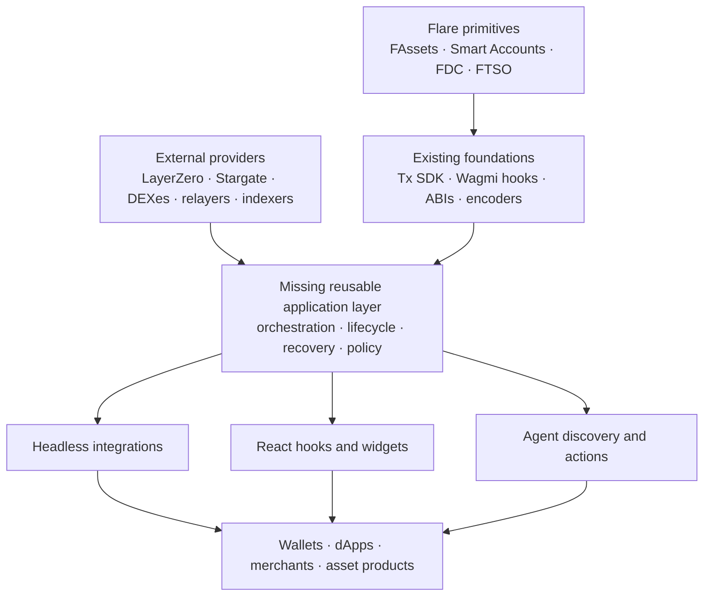

# Flare application layer

Status: accepted product direction, [comprehensive product specification](../specs/2026-08-03-flare-application-layer.md), [audited user stories](../stories/2026-08-03-flare-application-layer.md) and whole-application [product-surface map](../design/2026-08-03-product-surface-map.md); Claude Fable 5 owns visual design through an external commission, with direction acceptance pending.  
Canonical decision: [Full Flare Application Layer scope](../decisions/2026-08-03-full-flare-application-layer-scope.md).  
Research date: 2026-07-24.  
Primary research: [Flare application-layer reality](../research/2026-07-24-flare-application-layer-reality.md).  
Completeness audit: [Flare ecosystem and application-tooling completeness](../research/2026-07-24-flare-ecosystem-completeness-audit.md).  
Provenance: [application-layer sources](../raw/2026-07-24-flare-application-layer-sources.md) and [ecosystem-completeness sources](../raw/2026-07-24-flare-ecosystem-completeness-sources.md).

## The product idea, stated precisely

The proposed product is not simply another Flare dApp and not another wrapper around Viem.

The accepted product direction is:

> A Flare-native application layer that turns FAssets, Smart Accounts, data protocols and external asset routes into consistent, recoverable operations—available as headless TypeScript, React integrations, embeddable user experiences and policy-constrained agent tools.

This direction is no longer provisional. The accepted specification defines the complete system without using implementation order, demo design or the hackathon deadline to silently remove integration families.

The quality boundary is materiality, not a choice between “hackathon” and “enterprise.” The product
must be as strong as reasonably possible across experience, performance, correctness, recovery,
security and maintainability. Serious engineering remains in scope whenever it materially improves
the product or makes a claim true; irrelevant operational or certification work for authority and
environments the project does not claim must not become performative overhead.

## The Circle memory was a useful blend

The remembered “Circle App Kit” experience actually combines several products:

| Remembered capability | Product that currently owns it |
| --- | --- |
| Typed send, bridge, swap, unified balance and earn operations | Circle App Kit |
| Estimates, step progress, retries and partial recovery | Circle App Kit capability kits |
| Wallet modal, React buttons and packaged send/swap/onramp views | Reown AppKit |
| Passkeys, smart accounts, batching and sponsorship | Circle Modular Wallets |
| Email OTP/social login and user custody | Circle User-Controlled Wallets and, separately, Reown embedded wallets |
| CLI, wallet actions, skills and agent payments | Circle Agent Stack |

That is not a flaw in the idea. It reveals the desired product system: multiple coherent integration surfaces sharing one action vocabulary.

## What Flare already has

Flare's foundation is stronger than “raw contracts only.”

| Layer | Current first-party surface | What remains with each application |
| --- | --- | --- |
| General transactions | `@flarenetwork/flare-tx-sdk` | Browser/UI packaging and complete protocol-specific journeys |
| React contract access | `@flarenetwork/flare-wagmi-periphery-package` | Workflow composition, durable state and product UX |
| ABIs and addresses | Periphery packages and Contract Registry | Runtime validation and application semantics |
| EVM/XRPL wallet connection | WIP `@flarenetwork/multichain-wallet-connector` core + React bindings | Styled modal/widget UX and stable public API |
| Pre-signing inspection | `@flarenetwork/flare-tx-verifier-lib` and CLI | Integration into user/agent consent and lifecycle receipts |
| Low-level X/P/C actions | `@flarenetwork/flarejs` and `@flarenetwork/flare-stake-tool` | Consumer-facing composition and protocol-specific UX |
| Smart Account encoding | `@flarenetwork/smart-accounts-encoder` | XRPL submission, executor, monitoring, recovery and receipts |
| FAssets UX example | `fassets-demo-dapp` | Reusable package boundary and production operation |
| FAssets operator control | `fasset-agent-ui`, archived bots and self-hosted indexer/API | Supported reusable operator SDK/service boundary |
| Broad TypeScript examples | `flare-viem-starter` | Shared lifecycle engine, hooks and widgets |
| FAssets data | self-hostable `fasset-indexer` | Managed hosting, SLA, backfills and consumer abstraction |
| Agent knowledge | six Flare AI Skills and docs MCP | Safe transaction tools and real execution lifecycle |
| Agent runtime experiment | `flare-ai-kit` `0.1.0` alpha | Production FAssets/swap implementation and enforceable approval flow |
| Shared manual/agent actions | FCC weather-insurance+x402 reference | Production authentication, scoped authority and confirmation for MCP writes |

The opportunity begins above those layers rather than replacing them. The wallet-audit correction matters: a first-party headless EVM/XRPL React layer does exist, but its stable `0.0.1` README calls it WIP and it intentionally leaves visual presentation to the host. The accurate absence claim is **no first-party styled widget/composed lifecycle kit was found**, not “Flare has no first-party React or wallet layer.”

The current source-backed facts-only map is in [Capability inventory](capability-inventory.md); external provider and network coverage is in [Ecosystem tools](ecosystem-tools.md).

## The missing relationship

This is a product-boundary map, not an implementation architecture.

## Why protocol orchestration is the real product

Flare's most differentiated asset journeys cross several systems:

### Mint XRP into usable FXRP

`resolve parameters → encode recipient/executor → sign XRPL payment → await proof → execute mint → handle delay → credit/receipt`

### Use an XRPL-controlled Smart Account

`derive account → read nonce → build calls → encode memo → send XRP → executor picks up → execute on Flare → correlate event → recover if stuck`

### Redeem FXRP to XRP

`preflight queue/minimum → create obligations → await one or more XRP payments → confirm or prove non-payment → settle/default → receipt`

### Move FXRP crosschain

`discover peer/route → quote native fee → approve → send OFT → track LayerZero → execute compose → confirm destination state`

A contract hook can start one transaction. It does not by itself preserve this multi-chain, multi-actor state or tell an application what recovery remains safe. That is the application-layer gap.

## What “kit” has to mean in 2026

A few contract wrappers and styled buttons would not meet the current market baseline. The reviewed products establish these expectations:

- more than one integration depth: ready-made embed, framework hooks and headless access;
- typed estimates, execution steps, errors and receipts;
- progress that survives reloads and long crosschain waits;
- explicit partial-success and retry semantics;
- runtime capability and route discovery;
- transparent fees, gas, price impact, ETA and provider identity;
- allow/deny route policies and renewed consent when material quote terms change;
- adapter boundaries for wallets, signers, providers and indexers;
- theme, accessibility, responsive layouts, localization and product events for widgets;
- observable correlation IDs, explorer links and transaction history; and
- machine-readable documentation and tools whose authority is clear.

The durable value is the shared operation model beneath those surfaces.

## Product capability families

These are first-class parts of the intended product. The specification will define their shared concepts, package boundaries and engineering sequence; sequence does not remove a family from product scope.

| Family | Flare-specific value | Current boundary to respect |
| --- | --- | --- |
| FXRP acquire/mint | Makes XRP usable on Flare and exposes executor/delay/recovery states | XRPL payment and FDC are asynchronous; parameters are dynamic |
| FXRP redeem | Closes the return path to native XRP | Multiple agents, timing and non-payment proof can be involved |
| Smart Account actions | Lets XRPL users trigger Flare calls without managing FLR | `0xFE` is not confidential; executor and data availability remain required |
| Swap | Normalizes quoting/approval/slippage over Flare venues | No first-party universal router exists; liquidity and venue trust differ |
| Bridge/OFT | Moves connected assets across supported ecosystems | Peers, fees, DVNs, destination gas and compose support are route-specific |
| Gasless transfer | Removes the payer's FLR requirement | FXRP needs a custom forwarder/relayer and one-time approval; no native EIP-3009 |
| Portfolio/status | Correlates balances, pending journeys and receipts | Indexers may be self-hosted and require backfills/replay |
| FTSO data | Supplies current price/risk context | Feed metadata/decimals and fee configuration are dynamic |
| FDC proof workflow | Makes external facts consumable by products | Multi-round workflow and public service limits must be visible |
| Governance/staking | Extends the platform beyond asset movement | Network/proposal/P-chain state makes these distinct later domains |
| FCC | Could support a genuinely private operation | Separate beta lifecycle; not a normal synchronous “kit action” |

This table is a scope map, not a priority ranking. The more exhaustive factual inventory remains in [Capability inventory](capability-inventory.md); an omitted row here is not evidence that a capability was rejected.

## Agent surface: capability without silent authority

The agent requirement is meaningful, but it must use the same tested actions as the human-facing product.

| Stage | Safe default |
| --- | --- |
| Discover/read | No signer; return typed balances, routes, protocol state and provenance |
| Quote/plan | Compare routes and return fees, assumptions, expiry and unsigned intent |
| Simulate | Validate call, allowance, slippage, balance, chain and expected result |
| Policy/approval | Enforce asset, amount, route, target, function, time and spending boundaries |
| Execute | Wallet confirms, or a previously granted narrow session capability signs |
| Track/recover | Persist step state; expose safe retry/cancel/recovery choices |
| Receipt | Return hashes, providers, chains, amounts, fees, approvals and final status |

Three boundaries are important:

1. Documentation skills are not transaction tools.
2. A quote is not permission to sign or broadcast.
3. External proofs, APIs and XRPL fields are typed untrusted inputs, not free-form LLM context.

The current official skills already insist on per-action confirmation. The current alpha AI kit does not yet provide a production FAssets/swap or complete approval implementation.

The current FCC weather-insurance reference also demonstrates two materially different authority models. Its in-app assistant reuses application actions but keeps wallet writes client-side and shows an inline buy confirmation. Its separate MCP is explicitly development-only/no-auth, derives a wallet from `DEPLOYMENT_PRIVATE_KEY` and signs buys immediately. The latter is useful example code, not a production safety precedent.

## Aggregation without pretending all routes are equal

“Aggregator” is credible only if the product keeps route differences visible:

- supported source/destination networks and assets;
- bridge/DEX/relayer identity;
- trust and verification model;
- quoted output, fees, gas currency and price impact;
- approval and allowance requirements;
- estimated and worst-case time;
- destination execution/compose requirements;
- recoverability and refund behavior; and
- route freshness/expiry.

The product can normalize the developer interface while preserving provider-specific risk and lifecycle semantics.

## Hackathon alignment

### Bounty 1 — strong fit

The concept directly targets the bounty's asset-movement UX, FXRP onboarding, wallet, payment, DeFi, portfolio, liquidity and connected-ecosystem language.

It will look meaningful only if the product proves real Flare-specific integrations rather than presenting disconnected wrappers or mocked authority. Judges should be able to see:

- the Flare protocol or asset dependency;
- the operation's full lifecycle rather than only a submitted hash;
- a reusable integration surface, not only one app screen;
- failure/recovery behavior; and
- what was newly built during the programme.

### Bounty 2 — not currently claimed

The application layer does not automatically become a confidential-compute product. It belongs in Bounty 2 only if a required operation runs sensitive logic in an FCC TEE and the onchain consumer verifies/uses its bounded output. Privacy-themed UI, Smart Account `0xFE` memos or an “AI agent” label do not satisfy that standard.

## Full product scope versus demonstrations

The product includes FAssets, Smart Accounts, routing, gasless transfers, FDC/FTSO, wallets, swaps, bridges/OFTs, portfolio/indexer/analytics surfaces, governance/staking where supported, reusable UI and policy-constrained agents.

Demonstrations validate the product; they do not define or narrow it. Each demonstrated family must be implemented deeply enough to show its real lifecycle, authority and recovery semantics, while the specification preserves the complete cross-ecosystem application-layer architecture.

Implementation may be sequenced, but sequencing is a delivery-order decision—not permission to turn the product into a single-flow dApp or remove the other integration families.

## Explicit boundaries

- Do not describe the project as “Viem for Flare”; Flare already supports Viem/Wagmi and publishes typed hooks.
- Do not claim a managed universal bridge, swap, gasless or indexer service unless the project actually operates it.
- Do not advertise FXRP x402/EIP-3009 support today.
- Do not treat `0xFE` Smart Account instructions as confidential.
- Do not expose AI write tools that bypass wallet authority or policy.
- Do not add FCC merely to enter a second bounty.
- Do not promise identical behavior across Flare, Songbird, Coston2 and every connected chain.

## Accepted product surface and external visual-design gate

The full-kit product direction, [comprehensive product specification](../specs/2026-08-03-flare-application-layer.md), [audited user stories](../stories/2026-08-03-flare-application-layer.md) and whole-application [product-surface map](../design/2026-08-03-product-surface-map.md) are accepted. Claude Fable 5 owns visual and interaction design through the [external commission](../design/2026-08-03-designer-commission.md); no visual direction is accepted until the return passes contract audit and Abu's taste gate. Component architecture and package APIs remain outside this gate.

The prerequisite ecosystem audit is complete enough to support that specification: [Capability inventory](capability-inventory.md), [Ecosystem tools](ecosystem-tools.md), and the dated [completeness audit](../research/2026-07-24-flare-ecosystem-completeness-audit.md).

The specification defines:

- primary user and job-to-be-done;
- shared operation, lifecycle, recovery and receipt models across all capability families;
- headless, React, widget, provider-adapter and agent-facing package boundaries;
- authority/custody and hosted-service boundaries;
- network/provider support and qualification contract;
- integration-specific lifecycle and recovery contracts;
- observable success criteria; and
- explicit non-goals.

Once the specification is accepted, the next artifact is the user-story set. Once both are accepted, the product can be mapped into coherent surfaces without inventing scope.
