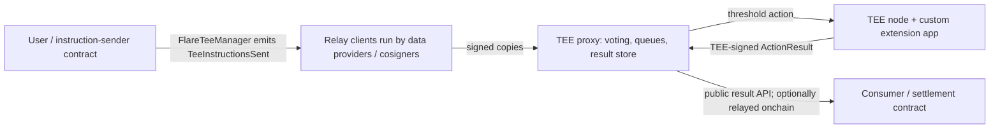

# Flare Confidential Compute (FCC)

Status: source-traced on 2026-07-22 and completeness-refreshed on 2026-07-24. See the pinned [source manifest](../raw/2026-07-22-flare-source-manifest.md) and [completeness addendum](../raw/2026-07-24-flare-ecosystem-completeness-sources.md).

## The useful mental model

FCC is not “call a TEE from Solidity.” It is a four-part system:

The on-chain hub is the `FlareTeeManager` diamond. Relay clients observe only its canonical instruction event, sign the instruction, and submit it to the selected machines' proxies. A proxy aggregates signing weight/cosigners, queues a passed action, and stores the machine's signed result. ([Architecture](../../sources/flare-foundation/flare-specs/src/FCC/Architecture.md), [instruction lifecycle](../../sources/flare-foundation/flare-specs/src/FCC/FCE/Workflows/Instructions.md), [relay client](../../sources/flare-foundation/flare-specs/src/FCC/Reference/Components/RelayClient.md))

Custom application code is a second process colocated with `tee-node` inside the same enclave. `tee-node` retains infrastructure operations and forwards custom `(opType, opCommand)` actions to the app's local `POST /action`. The app can call the node's unauthenticated localhost sign/decrypt service because the shared enclave boundary is the security boundary. ([machine](../../sources/flare-foundation/flare-specs/src/FCC/Reference/Components/Machine.md), [extension integration](../../sources/flare-foundation/tee-node/docs/extensions.md), [security model](../../sources/flare-foundation/tee-node/docs/security.md))

## Version alignment is a hard constraint

The repository heads in the research corpus are **not one compatible release set**. The current relay and scaffold-pinned `go-flare-common` include `chainId` in instruction/FDC/result signing domains, while the checked-out `tee-node`/`tee-proxy` heads still call older hash functions without that argument. The local proxy's `/info` signature format also predates the scaffold tool's expected domain separation. ([relay instruction signing](../../sources/flare-foundation/tee-relay-client/internal/router/instructions/instructions.go), [local node validation](../../sources/flare-foundation/tee-node/internal/processors/instructions/instructions.go), [local proxy validation](../../sources/flare-foundation/tee-proxy/internal/service/instruction/instruction.go), [scaffold TEE calls](../../sources/flare-foundation/fce-extension-scaffold/tools/pkg/fccutils/tee_calls.go))

Build rule: treat the scaffold's pinned, self-contained dependency graph as canonical. Do **not** enable `USE_LOCAL_SIBLINGS=1` against the cloned heads unless `tee-node`, `tee-proxy`, `tee-relay-client` and `go-flare-common` are deliberately aligned and their signing-compatibility tests pass. The sibling Dockerfile explicitly replaces the pinned node with the local checkout. ([scaffold go.mod](../../sources/flare-foundation/fce-extension-scaffold/go.mod), [tools go.mod](../../sources/flare-foundation/fce-extension-scaffold/tools/go.mod), [proxy Dockerfile](../../sources/flare-foundation/fce-extension-scaffold/proxy/Dockerfile), [sibling Dockerfile](../../sources/flare-foundation/fce-extension-scaffold/Dockerfile.siblings))

## Two execution paths

| Path | What authorizes execution | What it is good for | Critical limitation |
|---|---|---|---|
| On-chain instruction | An allowed instruction-sender contract, Flare transaction, current data-provider signing weight, plus optional cosigners | Settlement-affecting decisions and the strongest “meaningful Flare integration” story | More infrastructure and latency; relay delivery is best-effort. |
| Direct action | An HTTP client calling an enabled proxy `POST /direct`; normally an API key | Low-latency private queries, demos, and encrypted request/response UX | Bypasses C-chain emission and provider voting; it must not be presented as provider-consensus-authorized execution. |

The direct endpoint is disabled by default, rejects `F_` system operations, and current code refuses to start without an API key unless `api_key_optional = true`. The current configuration is a `[direct]` TOML table; the flat keys in `tee-proxy/README.md` are stale. ([actions](../../sources/flare-foundation/flare-specs/src/FCC/Concepts/Actions.md), [proxy config](../../sources/flare-foundation/tee-proxy/config.example.toml), [config validation](../../sources/flare-foundation/tee-proxy/pkg/config/config.go), [handler](../../sources/flare-foundation/tee-proxy/internal/server/external.go))

Product rule: use the on-chain instruction path for any outcome that releases, moves, or irrevocably commits assets. Direct mode is defensible for confidential previews or reads only if the UI names its weaker authorization path.

## Result contract

A custom handler must return an `ActionResult` that faithfully echoes the inbound `id`, `submissionTag`, `opType`, and `opCommand`. A mismatch is stored under an unreachable key. Status `0` means terminal failure and `1` terminal success. Statuses `>=2` are transient; a later transient may overwrite only with a strictly larger value, and a terminal result is write-once. The extension may reply synchronously or post later through the node/proxy result path. ([actions](../../sources/flare-foundation/flare-specs/src/FCC/Concepts/Actions.md), [scaffold result builder](../../sources/flare-foundation/fce-extension-scaffold/internal/extension/utils.go))

In the modern scaffold/spec protocol, providers and machines sign EIP-191 personal hashes over domain-separated payloads that include the chain ID. The core `ActionResult.Hash()` binds only `keccak256(data)`, action ID, hashed submission tag and status. It does **not** bind `opType`, `opCommand`, `additionalResultStatus`, version or log. An on-chain consumer must independently require the expected instruction/action ID, tag, terminal status, op semantics, registered TEE identity, chain/contract/application domain, decoded beneficiary/amount/deadline, and one-use replay state. ([modern instruction hash](../../sources/flare-foundation/go-flare-common/pkg/tee/instruction/instruction.go), [domain hash helper](../../sources/flare-foundation/go-flare-common/pkg/signing/hash.go), [result hash](../../sources/flare-foundation/tee-node/pkg/types/actions.go), [spec signature](../../sources/flare-foundation/flare-specs/src/FCC/Concepts/Actions.md), [weather verifier model](../../sources/flare-foundation/fce-weather-insurance/contracts/InstructionSender.sol))

Proxy result retention matters to frontend design: threshold/end results default to 14 days, direct `submit` results to 30 minutes, and backups to 8 days. Consumers should record finalized results/on-chain receipts they need beyond those windows. ([proxy state](../../sources/flare-foundation/flare-specs/src/FCC/Reference/Components/Proxy.md), [storage defaults](../../sources/flare-foundation/tee-proxy/pkg/config/config.go))

## What is actually attested

An extension record binds its owner, state verifier, instruction sender, supported code hashes/platforms and optional supported key types. A machine registers with an enclave-generated identity, code hash, platform, extension ID, owner and proxy metadata; FDC2 availability proof moves it into `PRODUCTION`. The attested identity/code binding is meaningful only if the image build is reproducible and the registered code hash is the one judges actually exercise. ([FCE concepts](../../sources/flare-foundation/flare-specs/src/FCC/FCE/Concepts.md), [configuration workflow](../../sources/flare-foundation/flare-specs/src/FCC/FCE/Workflows/Configuration.md), [machine registration](../../sources/flare-foundation/flare-specs/src/FCC/Reference/Contracts/FlareTeeManager.md))

The system extension (`extensionId = 0`) contains protocol code such as FDC2 and Protocol Managed Wallet operations. Public custom extension IDs begin at `65536`; custom op types cannot use the reserved `F_` prefix. ([system extension](../../sources/flare-foundation/flare-specs/src/FCC/FCE/System.md), [extension concepts](../../sources/flare-foundation/flare-specs/src/FCC/FCE/Concepts.md))

## Explicit trust and failure boundaries

- The TEE platform and its attestation chain must correctly bind code to the enclave and preserve isolation. Platform compromise collapses the guarantee.
- A malicious proxy can censor, delay or flood. It should not be able to manufacture an instruction that the TEE accepts, because the machine re-verifies signatures and thresholds.
- FCC assumes less than threshold-weight malicious data providers. A super-threshold collusion can rewrite or strip per-instruction cosigners; wallet-key system operations re-check cosigners against key-generation state, but custom FCEs must implement their own binding.
- The machine does not read the chain directly. It learns chain events through provider consensus.
- Delivery can duplicate or reorder, and FCC supplies no universal application nonce. Every state-mutating custom operation needs domain-level idempotency/replay protection.
- Proxy external HTTP is cleartext unless TLS is terminated upstream. Its internal port and the node configuration/sign ports rely on network isolation, not application authentication.
- On-chain `sendInstructions` messages are public event data. Sensitive inputs need client-side encryption to the selected TEE identity; using FCC does not conceal plaintext already emitted on-chain.
- Proxy result APIs are public. Sensitive outputs must be a commitment/ciphertext or a deliberately minimal reveal.
- The colocated sign/decrypt/result API exposes powerful unauthenticated operations to any process that can reach it. This is safe only inside the measured enclave boundary; `SIGN_PORT` and `CONFIG_PORT` must never be exposed.

Sources: [trust model](../../sources/flare-foundation/flare-specs/src/FCC/Concepts/TrustModel.md), [machine validation](../../sources/flare-foundation/flare-specs/src/FCC/Reference/Components/Machine.md), [proxy ports](../../sources/flare-foundation/tee-proxy/README.md), [node security](../../sources/flare-foundation/tee-node/docs/security.md).

## Stateful-app trap

The Hello World scaffold's state is process memory. The shielded-transfer example explicitly says its confidential ledger and replay nonces vanish on restart; the orderbook added balance snapshots after a test identified restart loss, but order histories remain bounded demo state. A product holding funds cannot equate “inside a TEE” with “durable.” It needs one of:

1. sealed/persisted state with recovery and versioning;
2. an event-sourced reconstruction path whose public leakage is acceptable;
3. replicated/backed-up state across machines; or
4. an intentionally stateless computation where the on-chain contract is the source of truth.

For the hackathon, the safest architecture is usually stateless or minimally stateful FCC: encrypt the private policy/input, compute a signed authorization, and keep custody/replay protection on-chain. ([scaffold state](../../sources/flare-foundation/fce-extension-scaffold/internal/extension/extension.go), [shielded-transfer architecture](../../sources/flare-foundation/fce-shielded-transfers/docs/architecture.md), [orderbook restart regression test](../../sources/flare-foundation/fce-orderbook/internal/extension/bugs_test.go))

The runtime has additional crash boundaries a serious demo should acknowledge:

- the machine identity key, wallet store and signing-policy store in the checked-out node are process memory;
- the scaffold's local Redis disables snapshot/AOF persistence;
- dequeue removes a queued action immediately, with no visibility timeout/requeue if the TEE crashes;
- the proxy acknowledges internal `POST /result` before asynchronous validation/storage, so a later failure can lose the result;
- extension processing is time-bounded; a non-cooperative handler can be abandoned with state potentially inconsistent.

Sources: [node identity](../../sources/flare-foundation/tee-node/pkg/node/node.go), [wallet storage](../../sources/flare-foundation/tee-node/pkg/wallets/storage.go), [policy storage](../../sources/flare-foundation/tee-node/pkg/policy/policy.go), [local Compose](../../sources/flare-foundation/fce-extension-scaffold/docker-compose.yaml), [proxy queue](../../sources/flare-foundation/tee-proxy/internal/queue/queue.go), [internal result API](../../sources/flare-foundation/tee-proxy/internal/server/internal.go), [router timeout](../../sources/flare-foundation/tee-node/internal/router/router.go).

## Current implementation seams

- Start from `fce-extension-scaffold`; the primary application edits are operation constants, request/result types, handler routing/logic, decoder registrations, instruction-sender contract and end-to-end test. ([scaffold README](../../sources/flare-foundation/fce-extension-scaffold/README.md))
- The Solidity/Go operation strings must hash to the same `bytes32` values. Use one canonical table and test both encodings.
- The scaffold currently vendors minimal TEE registry interfaces and marks migration to a published `flare-smart-contracts-v2` package as TODO. Do not assume the current `flare-smart-contracts-v2/main` supplies those sources. ([InstructionSender](../../sources/flare-foundation/fce-extension-scaffold/contracts/InstructionSender.sol))
- The formal custom-FCE HTTP API page in `flare-specs` is marked pending; the pinned scaffold plus `tee-node` forwarding code are the implementable contract today. ([FCE index](../../sources/flare-foundation/flare-specs/src/FCC/FCE/README.md), [forwarding docs](../../sources/flare-foundation/tee-node/docs/extensions.md))
- Local full setup is: deploy/register extension, start Redis/proxy/extension node, register code version and machine, then run the end-to-end instruction test. Coston2 additionally needs a public HTTPS proxy and C-chain indexer access. ([full setup](../../sources/flare-foundation/fce-extension-scaffold/scripts/full-setup.sh), [Developer Hub guide](../../developer-hub/docs/fcc/guides/00-getting-started.mdx))

### Live deployment traps

- A real deployment needs a GCP Confidential Space VM, public HTTPS proxy routing and VPN/indexer access; the documented local/Coston2 route is not equivalent to production attestation.
- Production must run `MODE=0`. The scaffold Docker/Compose defaults are simulation-friendly (`MODE=1` / `SIMULATED_TEE=true`) and must be explicitly overridden for a real availability proof.
- A registration retry may need a fresh challenge-bound attestation step; blindly rerunning the default post-build command can reuse an invalid one-shot challenge.
- Proxy example configuration disables bootstrap attestation verification. Production should enable JWT verification and pin expected code hash, platform, debug state, secure boot and freshness.
- `CHAIN_ID`, governance signer set and threshold must agree across node, proxy, signing tools and on-chain registration.
- Never enable unsafe URL mode outside local testing; it disables relay SSRF protection. Remote signer/verifier traffic carrying credentials/plaintext requires HTTPS.

Sources: [deployment steps](../../sources/flare-foundation/fce-extension-scaffold/docs/deployment-steps.md), [scaffold Dockerfile](../../sources/flare-foundation/fce-extension-scaffold/Dockerfile), [Compose](../../sources/flare-foundation/fce-extension-scaffold/docker-compose.yaml), [env example](../../sources/flare-foundation/fce-extension-scaffold/.env.example), [post-build](../../sources/flare-foundation/fce-extension-scaffold/scripts/post-build.sh), [registration CLI](../../sources/flare-foundation/fce-extension-scaffold/tools/cmd/register-tee/main.go), [proxy attestation config](../../sources/flare-foundation/tee-proxy/config.example.toml), [relay security notes](../../sources/flare-foundation/tee-relay-client/README.md).

## Current application and agent reference

`fce-weather-insurance-x402-agent` extends the earlier weather example with a Next.js application, x402 gateway, in-app OpenAI tool agent and external MCP server. It confirms that one typed application action set can serve manual UI and agent clients, but it also exposes two different signing boundaries:

- in-app wallet writes execute client-side, and buy actions show an inline confirmation; and
- the local MCP derives a wallet from `DEPLOYMENT_PRIVATE_KEY`, has no authentication and signs buy actions immediately.

The repository labels the MCP development-only and warns against public/mainnet use. It is therefore both a useful integration reference and a negative production-security boundary. ([application README](../../sources/flare-foundation/fce-weather-insurance-x402-agent/README.md), [frontend agent](../../sources/flare-foundation/fce-weather-insurance-x402-agent/docs/frontend-agent.md), [MCP security](../../sources/flare-foundation/fce-weather-insurance-x402-agent/docs/mcp-server.md))

`flare-vtpm-attestation` is current alpha Solidity work around GCP vTPM quote verification. Its existence does not change the documented requirement to align code hashes, platform attestation, machine registration and the compatible FCC release set.

## Hackathon design implications

1. Show the privacy delta: place the secret input and forbidden observer view side by side.
2. Show the attestation/identity/code-hash evidence, not only a “processed privately” badge.
3. Put custody and replay protection in contracts; let FCC decide/authorize rather than maintain the only copy of money-critical state.
4. Explain exactly what runs privately, what is signed, what a contract verifies, and which trust assumptions remain.
5. If using direct actions for responsiveness, separately demonstrate an on-chain threshold-authorized settlement path.
6. Avoid generic orderbook, shielded ledger, weather insurance or bare signing demos; official repos already implement those product cores. See [reference products](reference-products.md).

## Unresolved operational questions

- Whether hackathon teams receive shared Coston2 indexer credentials or a hosted custom-FCE path.
- Whether custom extensions will be accepted on Coston2 only or supported on Songbird during judging.
- Which FCC contract deployment/address set organizers want entrants to target after diamond recuts.
- Whether a public extension owner allowlist entry is automatic for participants or requires organizer action.

These questions are build blockers only for public deployment, not for local architecture/tests. Resolve them in the hackathon Telegram before committing the project schedule.
