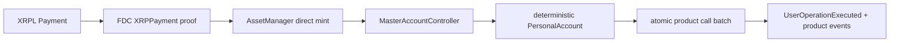

# FAssets, FXRP and Smart Accounts

Status: contract/source-traced on 2026-07-22 and completeness-refreshed on 2026-07-24. Revisions are pinned in the [source manifest](../raw/2026-07-22-flare-source-manifest.md) and [completeness addendum](../raw/2026-07-24-flare-ecosystem-completeness-sources.md).

## The product-level superpower

An XRPL payment can become FXRP on Flare and, through a deterministic Personal Account, execute an atomic batch of EVM calls. The protocol pieces exist. The underbuilt surface is the production executor, correlated receipts/recovery and a vertical workflow a real user recognizes.



## Conventional minting

The older reservation flow is:

1. reserve collateral against an agent and obtain the exact underlying address/payment reference;
2. pay the agent on XRPL;
3. request an FDC `IPayment.Proof`;
4. call `executeMinting`, which verifies recipient, reference, amount, payment window, caller/proof ownership and replay; and
5. let the AssetManager mint FXRP.

Canonical sources: [reservation facet](../../sources/flare-foundation/fassets/contracts/assetManager/facets/CollateralReservationsFacet.sol), [minting facet](../../sources/flare-foundation/fassets/contracts/assetManager/facets/MintingFacet.sol), [FAsset token authority](../../sources/flare-foundation/fassets/contracts/fassetToken/implementation/FAsset.sol).

The Hardhat starter demonstrates reservation, XRPL payment and proof execution as separate scripts, but its execution sample hardcodes transaction/round/CRT inputs. Reuse its FDC finality/DA helpers, not the sample's hardcoded orchestration. ([FAssets scripts](../../sources/flare-foundation/flare-hardhat-starter/scripts/fassets), [FDC helper](../../sources/flare-foundation/flare-hardhat-starter/scripts/utils/fdc.ts))

This path remains protocol context, but the current public XRP user journey is direct minting through the Core Vault. Conceptual/configuration references to BTC, DOGE or LTC FAssets do not establish equivalent current public FBTC/FDOGE/FLTC user flows; the current product documentation is FXRP-focused.

## Direct minting and routing

`executeDirectMinting` and `executeDirectMintingWithData` consume the richer `IXRPPayment.Proof`. Routing precedence is:

1. registered XRPL destination tag;
2. valid 32-byte direct-mint memo (recipient);
3. valid 48-byte extended memo (recipient + preferred executor);
4. otherwise, Smart Account callback.

For the Smart Account route, AssetManager mints the post-protocol-fee FXRP to the controller and forwards the XRPL transaction ID, source account, memo, executor and optional `_data`. ([direct-mint facet](../../sources/flare-foundation/fassets/contracts/assetManager/facets/DirectMintingFacet.sol))

Large/rate-limited direct mints can enter a delayed state. The safe continuation is to retry execution after `executionAllowedAt` with the **same XRPL payment and proof**; the user must not send XRP again. Minting Tags are transferable ERC-721 routing objects: transferring one changes the bound FXRP recipient and clears its optional executor.

The official demo already covers memo construction, dynamic fees/tags, Xaman payload creation/polling and a direct-mint UI. It deliberately relies on an external executor; it does not obtain the proof or submit AssetManager finalization itself. That missing executor is a real product seam. ([memo helper](../../sources/flare-foundation/fassets-demo-dapp/src/lib/directMintUtils.ts), [direct-mint UI](../../sources/flare-foundation/fassets-demo-dapp/src/components/DirectMint.tsx))

## Smart Account instruction modes

The controller is the only permitted AssetManager callback target. It derives/deploys a Personal Account from the XRPL source address, pays the executor from minted FXRP, transfers the remainder, and dispatches the memo. Smart Account payments must be **untagged**; a purchasable destination tag could otherwise redirect ownership. ([memo facet](../../sources/flare-foundation/flare-smart-accounts/contracts/smartAccounts/facets/MemoInstructionsFacet.sol))

| Opcode | Transport | When to use | Privacy reality |
|---|---|---|---|
| `0xFF` | Full ABI-encoded `PackedUserOperation` in XRPL memo | Small call batches and simplest coordination | Targets/calldata are public on XRPL and later on Flare. |
| `0xFE` | Fixed memo with `keccak256(userOp)`; executor supplies full bytes to `executeDirectMintingWithData` | Larger batches, predictable memo size, keep bytes off XRPL | Full bytes appear in the executor's Flare transaction calldata. This is off-XRPL delivery, not end-to-end confidentiality. |
| `0xE0` | Ignore a failed transaction memo on recovery | Recover FXRP after a custom instruction reverts | Control/recovery state. |
| `0xE1` | Advance memo nonce | Escape stuck/abandoned nonce state | Control/recovery state. |
| `0xE2` | Replace executor fee | Make a stuck payment economically executable | Control/recovery state. |
| `0xD0` / `0xD1` | Pin / unpin executor | Restrict delivery operator | Operational control. |

Sources: [memo instruction library](../../sources/flare-foundation/flare-smart-accounts/contracts/smartAccounts/library/MemoInstructions.sol), [Personal Account](../../sources/flare-foundation/flare-smart-accounts/contracts/smartAccounts/implementation/PersonalAccount.sol), [comparison guide](../../developer-hub/docs/smart-accounts/5-custom-instruction-comparison.mdx).

Personal Accounts are deterministic CREATE2 deployments and can be computed/lazily created. They support FXRP redemption and atomic arbitrary-call batches. ([PersonalAccounts library](../../sources/flare-foundation/flare-smart-accounts/contracts/smartAccounts/library/PersonalAccounts.sol))

The Viem starter already implements UserOp encoding, both memo modes, proof acquisition/finalization and example batches. A submission whose only new work is “send arbitrary calls from an XRP memo” is therefore weak. ([Smart Account helpers](../../sources/flare-foundation/flare-viem-starter/src/utils/smart-accounts.ts), [custom instruction example](../../sources/flare-foundation/flare-viem-starter/src/custom-instructions.ts))

The built-in instruction family also covers Firelight deposit and delayed withdrawal/claim plus Upshift deposit/request/claim. Smart Accounts can batch approval with an FXRP OFT send. A separate `FAssetRedeemComposer` can receive bridged FXRP through LayerZero compose data and start the normal XRP redemption path; the bridge step does not eliminate redemption timing/default semantics.

## FDC consumption, not provider infrastructure

Conventional minting uses `IPayment`; direct minting uses `IXRPPayment`. AssetManager verifies the configured chain/source and the FDC verification contract. A proof whose `proofOwner` is nonzero can be consumed only by that owner, preventing proof theft. ([transaction attestation](../../sources/flare-foundation/fassets/contracts/assetManager/library/TransactionAttestation.sol))

The strongest consumer helper is the Viem starter: prepare with the verifier, pay the FdcHub fee, submit, wait for Relay finalization, then retrieve the DA proof. ([Viem FDC helper](../../sources/flare-foundation/flare-viem-starter/src/utils/fdc.ts))

`fdc-client` is data-provider/voter infrastructure, not an app SDK. A product should consume Flare's verifier and DA services unless the product itself is provider infrastructure. ([fdc-client README](../../sources/flare-foundation/fdc-client/README.md), [DA service](../../sources/flare-foundation/fdc-client/server/daServices.go))

## Redemption lifecycle

FXRP transfers as a normal ERC-20 unless emergency-paused. Redemption burns FXRP and consumes redemption-queue tickets; agents then owe the underlying XRP payment. A missing/invalid payment can lead to an FDC nonexistence proof and a state-changing default payout. ([FAsset transfer](../../sources/flare-foundation/fassets/contracts/fassetToken/implementation/FAsset.sol), [redemption requests](../../sources/flare-foundation/fassets/contracts/assetManager/facets/RedemptionRequestsFacet.sol), [defaults](../../sources/flare-foundation/fassets/contracts/assetManager/facets/RedemptionDefaultsFacet.sol))

The demo's default UX stops after read-only proof verification and never calls `redemptionPaymentDefault`/`xrpRedemptionPaymentDefault`, despite success-style messaging. A complete redemption autopilot is therefore legitimate new work. Tagged XRP redemptions require the tag-aware function; the generic default explicitly rejects them. ([demo redemption](../../sources/flare-foundation/fassets-demo-dapp/src/components/Redeem.tsx), [demo FDC utils](../../sources/flare-foundation/fassets-demo-dapp/src/lib/fdcUtils.ts))

## Address and ABI discovery

Use the universal contract registry/current periphery exports. Do not copy an address from a demo configuration. The current package exports four network maps and includes Coston2 AssetManagerFXRP, FDC contracts and MasterAccountController. ([periphery entry](../../sources/flare-foundation/flare-npm-periphery-package/index.ts), [Coston2 exports](../../sources/flare-foundation/flare-npm-periphery-package/coston2/abis.ts), [Viem registry helper](../../sources/flare-foundation/flare-viem-starter/src/utils/flare-contract-registry.ts))

For every deployment:

1. assert chain ID;
2. resolve the named contract from the registry;
3. confirm non-empty bytecode;
4. record the resolved address and block/date in the submission;
5. avoid mixing Coston2 verifier/DA endpoints with a mainnet RPC.

## Verified integration hazards in official examples

These are useful bug maps, not criticism of intentionally educational samples:

- Demo redemption hashes an XRPL base58 address through a hex-oriented path; do not copy it. Use the protocol's canonical underlying-address byte encoding.
- Demo redemption verifies non-payment but does not execute the default transaction.
- Demo FDC helpers accept a chain parameter but read through a singleton Flare-mainnet client while using Coston2/`testXRP` endpoints.
- Demo proof timing sleeps and polls instead of first proving Relay finalization.
- Viem example memo flows set executor fee to zero; a real executor needs compensation.
- A Viem watcher is installed after the XRPL send and has no history backfill/timeout, so it can race or hang.
- The FAssets indexer omits newer Smart Account memo events and excludes Smart Account direct mints from some per-user totals.
- Demo transfer converts token amounts through floating-point multiplication; use exact decimal parsing (`parseUnits`/big integers).
- Hardhat agent selection rejects exactly sufficient capacity (`>` vs the contract's `>=`).

Source pointers: [demo redemption](../../sources/flare-foundation/fassets-demo-dapp/src/components/Redeem.tsx), [demo FDC utils](../../sources/flare-foundation/fassets-demo-dapp/src/lib/fdcUtils.ts), [demo public client](../../sources/flare-foundation/fassets-demo-dapp/src/lib/publicClient.ts), [Viem Smart Accounts](../../sources/flare-foundation/flare-viem-starter/src/utils/smart-accounts.ts), [indexer Smart Account events](../../sources/flare-foundation/fasset-indexer/packages/fasset-indexer-core/src/indexer/eventlib/store-logic/smart-accounts.ts), [demo transfer](../../sources/flare-foundation/fassets-demo-dapp/src/components/Transfer.tsx), [Hardhat reservation](../../sources/flare-foundation/flare-hardhat-starter/scripts/fassets/reserveCollateral.ts).

## Already built: weak standalone entries

- basic XRP→FXRP direct-mint UI;
- simple FXRP transfer/redeem wallet;
- minting-tag manager;
- generic FAssets dashboard/explorer;
- scripts demonstrating `0xFF`/`0xFE`;
- basic FDC request/proof retrieval.

## High-value product seams

### Production Smart Account intent executor

Implement the missing durable pipeline:

```text
XRPL observation
 -> confirmation policy
 -> FDC request
 -> Relay finality
 -> DA proof
 -> direct-mint submission
 -> delayed-mint retry
 -> UserOperationExecuted backfill
 -> downstream product receipt
```

Required value beyond the starter: idempotency, replay-safe retry, fee policy, queue/monitoring, historical log backfill, recovery opcodes and a user-facing status API.

### Vertical one-payment product

Use `0xFE` as transport for merchant checkout, conditional escrow, strategy deposit or another named job. Novelty must live in the product contract, executor lifecycle and distribution/user evidence—not in UserOp encoding.

### Unified XRP→Flare receipt layer

Correlate XRPL transaction ID → FDC round/proof → AssetManager direct mint → Personal Account → `UserOperationExecuted` → downstream calls. Extend the indexer for the current memo events and expose merchant/user receipts.

### Redemption autopilot

Monitor the agent payment window, prove tag-aware nonexistence, call the correct default method, surface collateral payout and retain an auditable lifecycle.

The strongest Bounty 1 shape combines a vertical XRP intent product with the executor and correlated receipt layer. That uses a distinctly Flare primitive while filling gaps the existing demos genuinely leave open.
