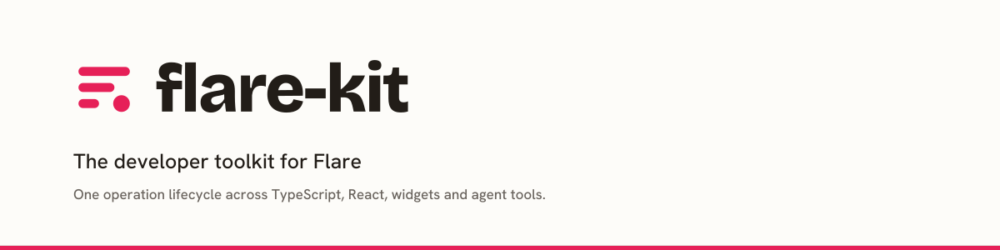
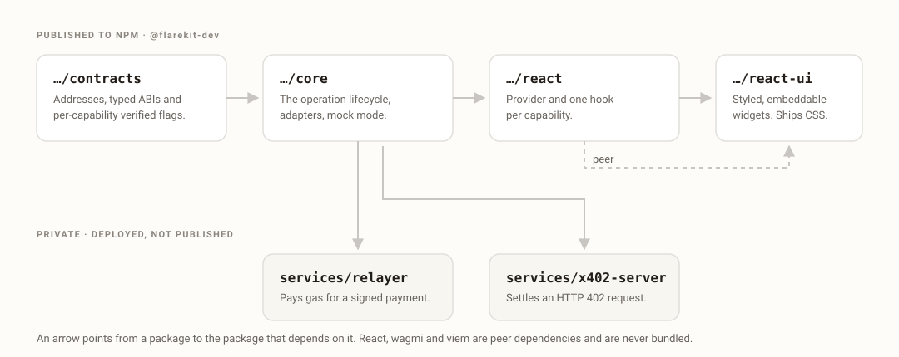
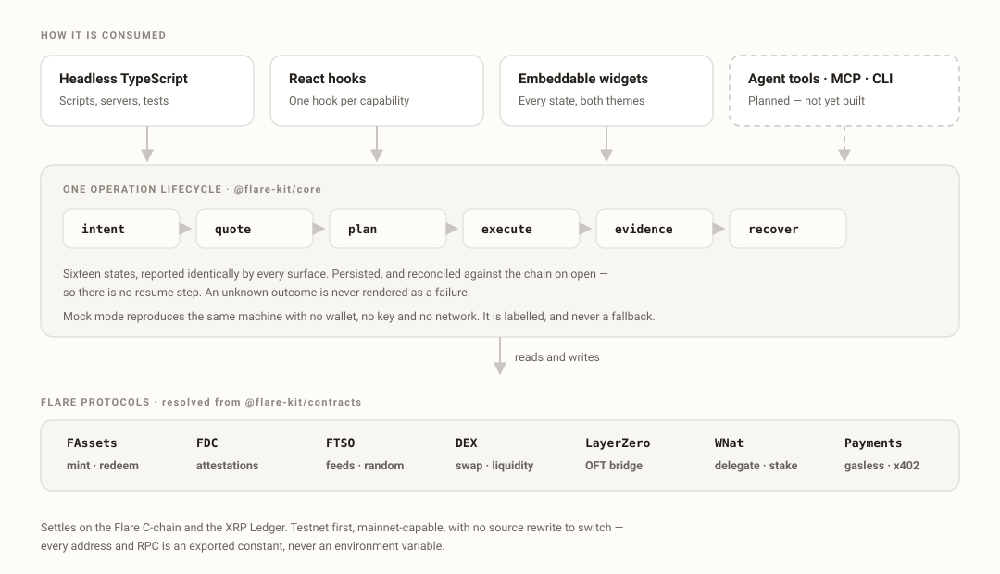
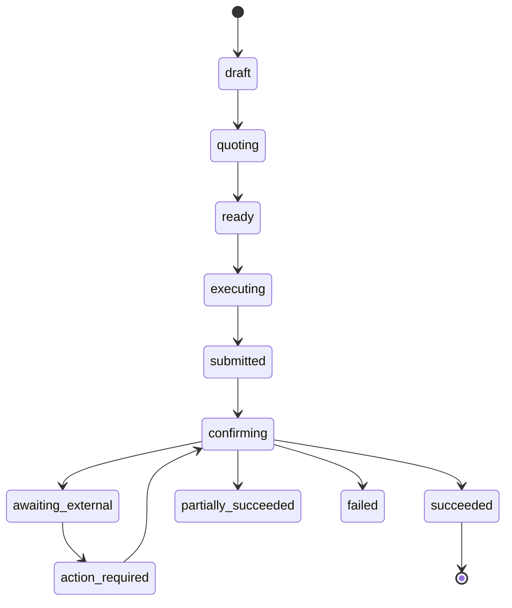

[](LICENSE)

> Community-built. Not an official Flare Networks product.

Flare has strong low-level contracts, SDKs and encoders. What it does not have
is one coherent application layer above them — a shared vocabulary for
orchestration, durable lifecycle state, recovery, reusable UI, and safely
bounded agent actions. That is what this is.

Every surface reports the same sixteen operation states, the same typed errors,
the same evidence. A widget, a hook, a headless script and an agent tool
describe the same operation the same way.

## Packages

| Package | What it is |
| --- | --- |
| [`@flarekit-dev/contracts`](packages/contracts) | Addresses, typed ABIs, and the per-capability verification flags. No address is hardcoded anywhere else. |
| [`@flarekit-dev/core`](packages/core) | The operation lifecycle, protocol adapters, durable persistence and self-reconciliation, and mock mode. Headless. |
| [`@flarekit-dev/react`](packages/react) | Provider and one hook per capability. |
| [`@flarekit-dev/react-ui`](packages/react-ui) | Styled, embeddable widgets with every state built. Themed by runtime CSS custom properties. |



## Architecture



## The lifecycle



Four states exist because the alternative is a lie. `submitted` is never
rendered as `succeeded`. `awaiting_external` means the outcome is genuinely
unknown, and is never rendered as `failed`. `action_required` means the
protocol is waiting on the user — an XRP Ledger payment inside a deadline, for
example. `partially_succeeded` means exactly that.

## Status

Built and driven live on the Coston2 testnet, with transaction hashes and
explorer links recorded as evidence:

FAssets mint and redeem · accounts, portfolio and activity · Flare Data
Connector across four attestation families · FTSO feeds, history, secure random
and fast-update incentives · swaps · liquidity · vaults · cross-chain bridge
(LayerZero V2 OFT, Coston2 ↔ Sepolia ↔ XRPL) · gasless payments · x402 /
HTTP-402 · delegation · reward claims.

Staking is built and its reads are live; the value-locking broadcast has not
been made, so `stakeVerified` is `false` rather than assumed.

**Not built:** governance, XRPL-controlled smart accounts, confidential
compute, agent and MCP tools, the CLI, the scaffolder, the documentation site,
and the application. Nothing here is dropped — anything that cannot be built to
the bar ships declared unbuilt rather than built badly.

The packages are not yet published to npm.

## Development

```bash
pnpm install
pnpm build && pnpm typecheck && pnpm lint && pnpm test
```

All four must pass before any release. Run the component gallery — every
documented state, in both themes, against the mock:

```bash
pnpm --filter @flarekit-dev/react-ui gallery
```

pnpm workspaces with Turborepo. `packages/*` publish; `services/*` are private
and deploy. Releases are driven by changesets.

## Reading further

- [`SPEC.md`](SPEC.md) — the current milestone and the repository file manifest
- [`DESIGN.md`](DESIGN.md) — the token contract, which outranks every default
  and component library
- [`.thoughts/specs/`](.thoughts/specs) — product requirements
- [`.thoughts/decisions/`](.thoughts/decisions) — accepted decisions and why
- [`.thoughts/verification/`](.thoughts/verification) — live-run evidence per
  milestone

## License

MIT © Abubakr Jimoh
