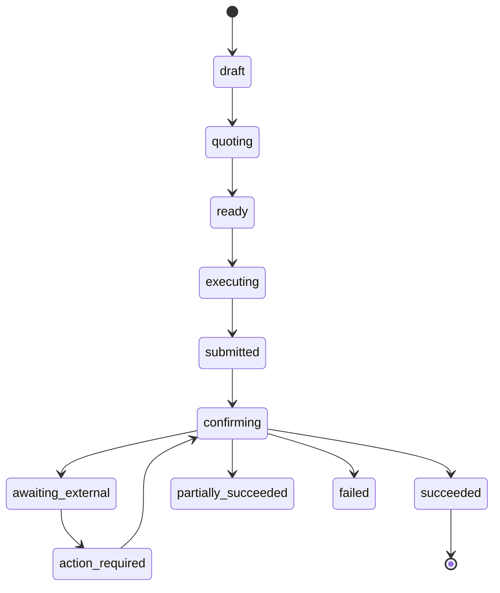

<p align="center">
  
</p>

<h1 align="center">flare-kit</h1>

<p align="center"><strong>The developer toolkit for Flare.</strong></p>

<p align="center">
  One operation lifecycle across headless TypeScript, React hooks, embeddable widgets and agent tools.
</p>

<p align="center">
  <a href="https://flare-kit.xyz"><b>Documentation</b></a>
  &nbsp;·&nbsp;
  <a href="https://app.flare-kit.xyz"><b>▶&nbsp; The app</b></a>
  &nbsp;·&nbsp;
  <a href="#quickstart"><b>Quickstart</b></a>
  &nbsp;·&nbsp;
  <a href="#status"><b>Status</b></a>
</p>

<p align="center">
  
</p>

<p align="center">
  <a href="LICENSE"></a>
  &nbsp;
  
  &nbsp;
  
</p>

> **Community-built. Not an official Flare Networks product.**

## What is flare-kit?

Flare has strong low-level contracts, SDKs and encoders. What it does not have
is one coherent application layer above them — a shared vocabulary for
orchestration, durable lifecycle state, recovery, reusable UI, and safely
bounded agent actions. That is what this is.

Every surface reports the same sixteen operation states, the same typed errors,
the same evidence. A widget, a hook, a headless script and an agent tool
describe the same operation the same way.

## Install

```bash
pnpm add @flarekit-dev/core viem
```

`core` is headless and has no React dependency. Add the layers you actually
want:

```bash
pnpm add @flarekit-dev/react                    # provider + one hook per capability
pnpm add @flarekit-dev/react-ui                 # styled, embeddable widgets
pnpm add @flarekit-dev/contracts                # addresses and typed ABIs, standalone
```

`viem` and `react` are **peer** dependencies — the kit never bundles its own
copy of either. Node >= 21.

## Quickstart

The fastest honest thing you can run is the mock. It reproduces the entire
state machine — including the delayed, action-required and recovered paths —
with no wallet, no key and no network.

```tsx
import { createMockKit } from '@flarekit-dev/core'
import { FlareProvider } from '@flarekit-dev/react'
import { MintFXRP } from '@flarekit-dev/react-ui'
import '@flarekit-dev/react-ui/styles.css'

const kit = createMockKit()

export function App() {
  return (
    <FlareProvider kit={kit}>
      <MintFXRP
        recipient="0xYourEvmAddress"
        xrplAccount="rYourXrplAccount"
        defaultAmountXrp="20"
      />
    </FlareProvider>
  )
}
```

That widget is not a placeholder. It quotes against the real fee model, refuses
below the protocol minimum, and walks the same sixteen states a live mint does.

> **Mock mode is explicit, labelled, and never a fallback.** A kit that cannot
> reach the chain reports that it cannot, rather than silently degrading into
> fiction.

### Going live

Network is configuration. There is no source rewrite between testnet and
mainnet, and no address is literal outside `@flarekit-dev/contracts`.

```ts
import { FLARE_NETWORKS } from '@flarekit-dev/contracts'
import { createFlareKit } from '@flarekit-dev/core'
import { createPublicClient, http } from 'viem'

const network = FLARE_NETWORKS.coston2 // or FLARE_NETWORKS.flare

const kit = await createFlareKit({
  client: createPublicClient({ transport: http(network.rpcUrl) }),
  chainId: network.id,
})
```

`createFlareKit` is genuinely async and genuinely fails: it reads protocol
state before it will hand back a kit. Handle the rejection — do not fall back
to the mock.

### Headless

No React required. The lifecycle is the product; the hooks are a thin binding.

```ts
import { createMockKit } from '@flarekit-dev/core'

const kit = createMockKit()

const intent = {
  amountXrp: '20', // an exact decimal string, never a float
  recipient: '0xYourEvmAddress',
  xrplAccount: 'rYourXrplAccount',
}

const quote = kit.quote(intent)
console.log(quote.mintedEstimate, quote.mintingFee, quote.minimumPayment)

let operation = kit.start(intent)
operation = await kit.reconcile(operation)
console.log(operation.state) // 'draft' → … → 'succeeded'
```

The same four calls — `quote`, `start`, `reconcile`, and the redemption mirror
`quoteRedeem` / `startRedeem` / `reconcileRedeem` — are the entire kit surface.
A live kit and the mock implement the identical interface, which is why no
component anywhere branches on which one it was handed.

### With hooks

One hook per capability, each returning the same shape: a quote function, a
start function, the live operation, a typed error, and the account binding the
quote was made against.

```tsx
import { useRedeem } from '@flarekit-dev/react'

function Redeem() {
  const { quote, start, operation, error, isSettled } = useRedeem()
  // operation.state is one of the sixteen; error is typed, never a bare string
}
```

## Packages

| Package | What it is |
| --- | --- |
| [`@flarekit-dev/contracts`](packages/contracts) | Addresses, typed ABIs, and the per-capability verification flags. No address is hardcoded anywhere else. |
| [`@flarekit-dev/core`](packages/core) | The operation lifecycle, protocol adapters, durable persistence and self-reconciliation, and mock mode. Headless. |
| [`@flarekit-dev/react`](packages/react) | Provider and one hook per capability. |
| [`@flarekit-dev/react-ui`](packages/react-ui) | Styled, embeddable widgets with every state built. Themed by runtime CSS custom properties. |

<p align="center">
  
</p>

## Architecture

<p align="center">
  
</p>

## The lifecycle

Sixteen states: `draft`, `discovering`, `quoting`, `awaiting_input`,
`awaiting_approval`, `ready`, `executing`, `submitted`, `confirming`,
`awaiting_external`, `action_required`, `partially_succeeded`, `succeeded`,
`failed`, `cancelled`, `expired`. The common path through them:



Four of those states exist because the alternative is a lie. `submitted` is
never rendered as `succeeded`. `awaiting_external` means the outcome is
genuinely unknown, and is never rendered as `failed`. `action_required` means
the protocol is waiting on the user — an XRP Ledger payment inside a deadline,
for example. `partially_succeeded` means exactly that.

Operations are non-blocking and self-reconciling. Submitting never locks the
UI, every operation persists its state and evidence, and it reconciles against
the chain when the app reopens. There is no Resume button.

## Status

This project publishes what it has actually done and declares the rest unbuilt.
Nothing below is aspirational.

**Built and driven live on Coston2**, with transaction hashes and explorer
links recorded as evidence:

FAssets mint and redeem · accounts, portfolio and activity · Flare Data
Connector across four attestation families · FTSO feeds, history, secure random
and fast-update incentives · swaps · liquidity · vaults · cross-chain bridge
(LayerZero V2 OFT, Coston2 ↔ Sepolia ↔ XRPL) · gasless payments · x402 /
HTTP-402 · delegation · reward claims · governance delegation · XRPL-controlled
smart accounts.

**Carried, and declared unbuilt** — nothing here is dropped, and anything that
cannot be built to the bar ships declared unbuilt rather than built badly:

| Surface | State |
| --- | --- |
| Agent tools, MCP server, CLI | Specified, not built |
| Scaffolder (`create-flare-kit-app`) | Not built |
| Flare Confidential Compute | Not built |
| Operator release and claim | Not built |
| Staking broadcast | Reads are live; the value-locking broadcast has not been made, so `stakeVerified` is `false` rather than assumed |
| Governance `castVote` / `propose` / `execute` | Carried |

## Development

```bash
pnpm install
pnpm build && pnpm typecheck && pnpm lint && pnpm test
```

All four must pass before any release. Run the component gallery — every
documented state, in both themes, against the mock:

```bash
pnpm --filter @flarekit-dev/react-ui gallery
```

pnpm workspaces with Turborepo. `packages/*` publish; `apps/*` and `services/*`
deploy. Releases are driven by changesets. Packages ship dual ESM/CJS and must
pass `publint`.

### Repository layout

```
packages/    contracts, core, react, react-ui — the published kit
apps/        site (flare-kit.xyz), app (app.flare-kit.xyz)
services/    relayer, x402-server — reference backends
brand/       marks, banners, diagrams
```

## Principles

These are enforced, not aspirational.

- **Never fake protocol reality.** No invented balances, transaction hashes,
  proof results, executor outcomes or provider health. An unknown outcome is
  never rendered as failed.
- **Network is configuration.** Testnet first, mainnet-capable, no source
  rewrite to switch.
- **Public values are constants, not environment variables.** RPC URLs, chain
  IDs and contract addresses are exported constants. The only secrets are
  signing keys, and they are never committed, logged or included in receipts.
- **Exact values render in the mono face** with tabular numerals, carrying
  their asset and full precision.
- **Reuse, do not re-code.** One shared component per pattern.

## Reading further

- [`DESIGN.md`](DESIGN.md) — the token contract, which outranks every default
  and component library
- [`CLAUDE.md`](CLAUDE.md) — the engineering rules this repository is held to

## License

MIT © Abubakr Jimoh
