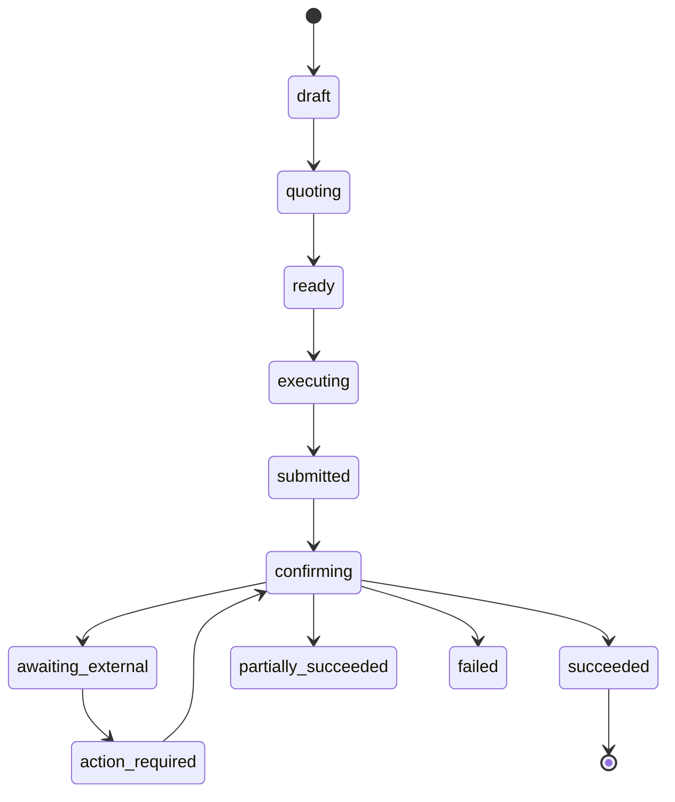

<p align="center">
  
</p>

<h1 align="center">flare-kit</h1>

<p align="center"><strong>The developer toolkit for Flare.</strong></p>

<p align="center">
  One operation lifecycle across headless TypeScript, React hooks, embeddable widgets and agent tools.
</p>

<p align="center">
  <a href="https://flare-kit.xyz"><b>Documentation</b></a>
  &nbsp;·&nbsp;
  <a href="https://app.flare-kit.xyz"><b>▶&nbsp; The app</b></a>
  &nbsp;·&nbsp;
  <a href="https://www.npmjs.com/package/@flarekit-dev/core"><b>Packages</b></a>
  &nbsp;·&nbsp;
  <a href="https://github.com/Blockchain-Oracle/flare-kit"><b>Source</b></a>
</p>

<p align="center">
  
</p>

<p align="center">
  <a href="LICENSE"></a>
  &nbsp;
  
  &nbsp;
  
</p>

> **Community-built. Not an official Flare Networks product.**
>
> The site, the app and the npm packages in the row above are **not deployed or
> published yet** — see [Status](#status). Everything else here is built, and
> most of it has been driven live on Coston2 with transaction hashes recorded.

## What is flare-kit?

Flare has strong low-level contracts, SDKs and encoders. What it does not have
is one coherent application layer above them — a shared vocabulary for
orchestration, durable lifecycle state, recovery, reusable UI, and safely
bounded agent actions. That is what this is.

Every surface reports the same sixteen operation states, the same typed errors,
the same evidence. A widget, a hook, a headless script and an agent tool
describe the same operation the same way.

**New here?** Start with the [documentation](https://flare-kit.xyz) — 83 pages
covering every component, hook and package surface, each preview running the
real component against the real mock.

## Packages

| Package | What it is |
| --- | --- |
| [`@flarekit-dev/contracts`](packages/contracts) | Addresses, typed ABIs, and the per-capability verification flags. No address is hardcoded anywhere else. |
| [`@flarekit-dev/core`](packages/core) | The operation lifecycle, protocol adapters, durable persistence and self-reconciliation, and mock mode. Headless. |
| [`@flarekit-dev/react`](packages/react) | Provider and one hook per capability. |
| [`@flarekit-dev/react-ui`](packages/react-ui) | Styled, embeddable widgets with every state built. Themed by runtime CSS custom properties. |

<p align="center">
  
</p>

## Architecture

<p align="center">
  
</p>

## The lifecycle



Four of those states exist because the alternative is a lie. `submitted` is
never rendered as `succeeded`. `awaiting_external` means the outcome is
genuinely unknown, and is never rendered as `failed`. `action_required` means
the protocol is waiting on the user — an XRP Ledger payment inside a deadline,
for example. `partially_succeeded` means exactly that.

## Status

**Built and driven live on Coston2**, with transaction hashes and explorer links
recorded as evidence in [`.thoughts/verification/`](.thoughts/verification):

FAssets mint and redeem · accounts, portfolio and activity · Flare Data
Connector across four attestation families · FTSO feeds, history, secure random
and fast-update incentives · swaps · liquidity · vaults · cross-chain bridge
(LayerZero V2 OFT, Coston2 ↔ Sepolia ↔ XRPL) · gasless payments · x402 /
HTTP-402 · delegation · reward claims · governance delegation · XRPL-controlled
smart accounts.

**Built, not yet deployed:** the documentation site (83 pages) and the
application shell.

**Carried, and declared unbuilt** — nothing here is dropped, and anything that
cannot be built to the bar ships declared unbuilt rather than built badly:

| Surface | State |
| --- | --- |
| Agent tools, MCP server, CLI | Specified, not built — [spec](.thoughts/specs/2026-08-14-chat-and-mcp.md) |
| Scaffolder (`create-flare-kit-app`) | Not built |
| Flare Confidential Compute | Not built |
| Operator release and claim | Not built |
| Staking broadcast | Reads are live; the value-locking broadcast has not been made, so `stakeVerified` is `false` rather than assumed |
| Governance `castVote` / `propose` / `execute` | Carried |
| npm packages | Publish-ready, **not published** |
| `flare-kit.xyz`, `app.flare-kit.xyz` | **Not deployed** |

## Development

```bash
pnpm install
pnpm build && pnpm typecheck && pnpm lint && pnpm test
```

All four must pass before any release. Run the component gallery — every
documented state, in both themes, against the mock:

```bash
pnpm --filter @flarekit-dev/react-ui gallery
```

pnpm workspaces with Turborepo. `packages/*` publish; `apps/*` and `services/*`
deploy. Releases are driven by changesets.

## Reading further

- [`SPEC.md`](SPEC.md) — the current milestone and the repository file manifest
- [`DESIGN.md`](DESIGN.md) — the token contract, which outranks every default
  and component library
- [`.thoughts/specs/`](.thoughts/specs) — product requirements
- [`.thoughts/decisions/`](.thoughts/decisions) — accepted decisions and why
- [`.thoughts/verification/`](.thoughts/verification) — live-run evidence per
  milestone

## License

MIT © Abubakr Jimoh
